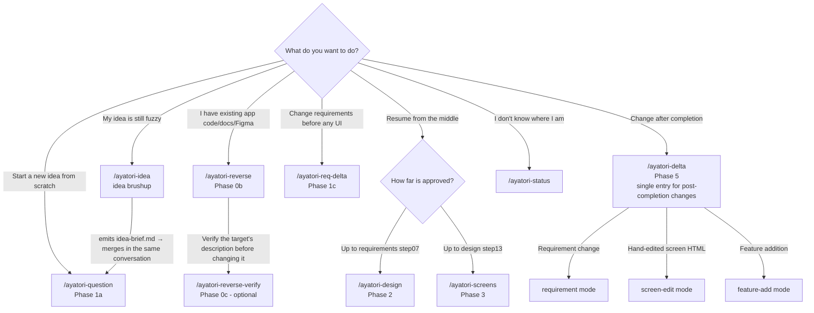
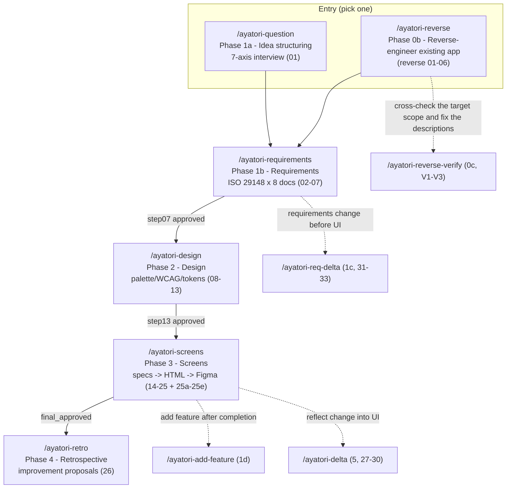
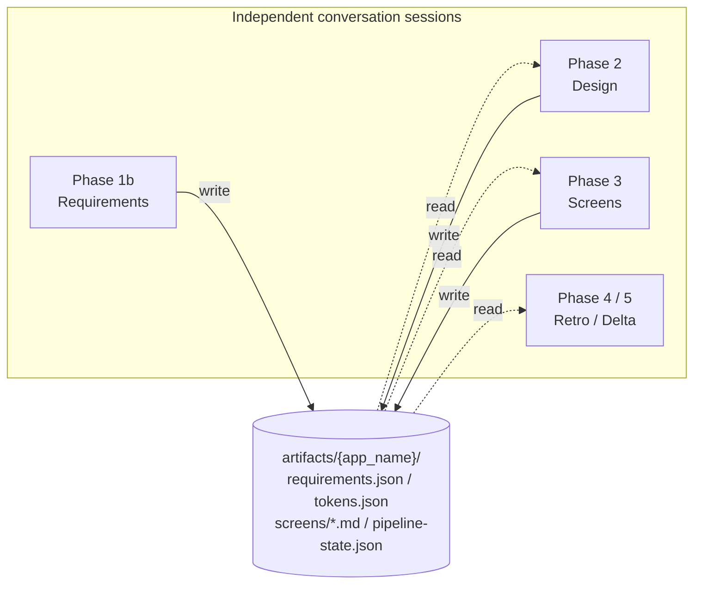
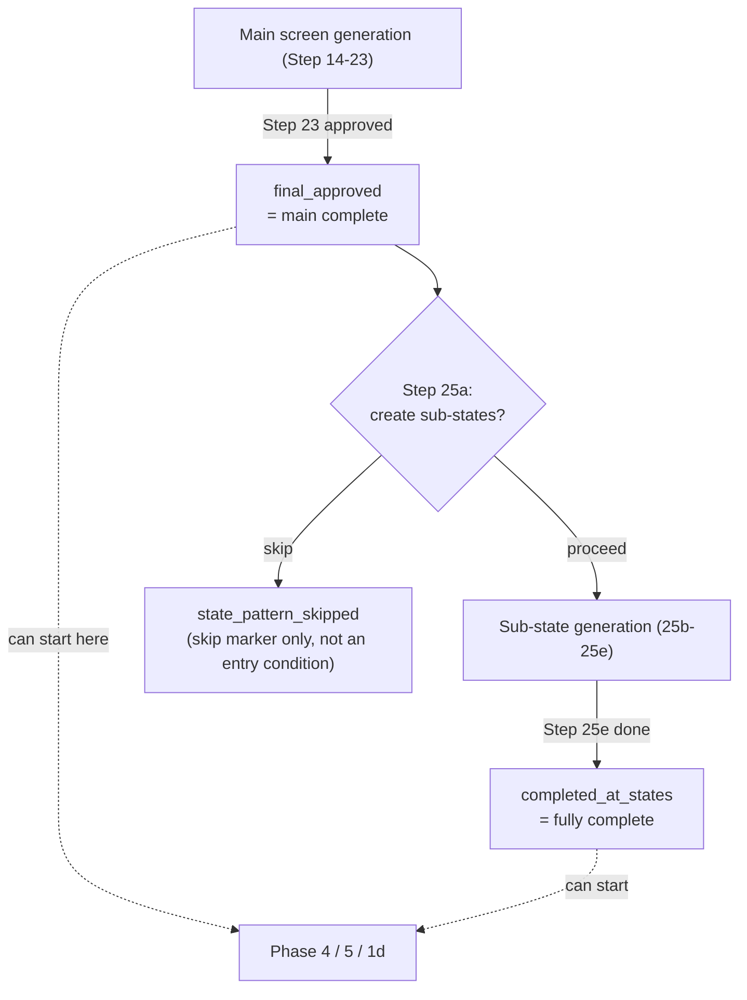

🌐 [日本語](ayatori-user-guide.md) | **English**

# AYATORI Pipeline — User Guide

> **AYATORI** — a pipeline that incrementally generates UI design, screen specifications, and a design system from an app idea.

This guide is written for first-time users and covers **where to start**, the **overall flow**, and the **role of each phase**.
The authoritative source at runtime is always [`pipeline.yaml`](../pipeline.yaml) / [`CLAUDE.md`](../CLAUDE.md). If you find a discrepancy, the source files take precedence.

---

## Table of Contents

1. [Where do I start? (Start here if unsure)](#1-where-do-i-start-start-here-if-unsure)
2. [Overall flow](#2-overall-flow)
3. [Entry points by use case](#3-entry-points-by-use-case)
4. [Phase reference](#4-phase-reference)
5. [Concepts you should know](#5-concepts-you-should-know)
6. [FAQ](#6-faq)

---

## 1. Where do I start? (Start here if unsure)

Find the row closest to your situation and run the corresponding command.
**For normal new development, start with `/ayatori-question`.** When you are not sure where you are, `/ayatori-status` tells you your current position and the recommended next action.

| Your situation / what you want to do                                           | Command                |
|--------------------------------------------------------------------------------|------------------------|
| Turn a brand-new app idea into something concrete (most common starting point) | `/ayatori-question`    |
| Your idea is still fuzzy — bounce it around until it solidifies                | `/ayatori-idea` (merges into the 7-axis interview in the same conversation once solid) |
| You have an existing app's materials — code, documents, Figma (want to reverse-engineer it) | `/ayatori-reverse`     |
| Check whether the reverse-generated requirements / screen specs match reality — for the part you are about to change | `/ayatori-reverse-verify` |
| Requirements are approved; start from design                                   | `/ayatori-design`      |
| Design is approved; start from screen generation                               | `/ayatori-screens`     |
| Change only the requirements before any UI exists                              | `/ayatori-req-delta`   |
| Change a completed project (requirement change / hand-edited screen / feature add) | `/ayatori-delta` (single entry for post-completion changes) |
| Hand-edited screen HTML outside the pipeline → reflect into the screen spec (edits that diverge from the requirements can be promoted into the requirement docs at the gate) | `/ayatori-delta` (screen-edit mode) |
| Add a feature to a completed project (from an interview)                       | `/ayatori-add-feature` (or `/ayatori-delta` feature-add mode) |
| Need a self-contained document for external sharing / delivery                 | `/ayatori-export`      |
| See all deliverables in one screen (requirements/screens/design/scoring)       | `/ayatori-index`       |
| Consult on behavior change / nudge design (ChargeMinder)                       | `/ayatori-cm-consult`  |
| Not sure how far you've progressed / what to do next                           | `/ayatori-status`      |

### How to choose an entry point (decision tree)

---

## 2. Overall flow

The main line is one-directional: **Entry → Requirements → Design → Screens → Retrospective**. Each phase runs in an independent conversation, and **phases communicate only through files under `artifacts/{app_name}/`** (no direct state sharing).

### Change / delta family (requirements change / post-completion updates)

| Command                | Phase / Step | Purpose                                                                        |
|------------------------|--------------|--------------------------------------------------------------------------------|
| `/ayatori-reverse-verify` | 0c (V1–V3) | Cross-check the reverse-generated descriptions for one target scope (fixes wording only — never changes the requirements themselves) |
| `/ayatori-req-delta`   | 1c (31–33)   | Propagate a requirements-level change (no UI yet) across the 8 docs            |
| `/ayatori-add-feature` | 1d (01b)     | Feature addition after completion via 7-axis interview → connect to delta      |
| `/ayatori-delta`       | 5 (27–30)    | Single entry for post-completion changes (requirement / screen-edit / feature-add); regenerate only changed screens and update only the corresponding Figma frames |
| `/ayatori-delta-mini`  | 6 (34)       | Lightweight retrospective for delta / req-delta runs                           |

### Auxiliary / standalone commands (runnable anytime)

| Command               | Purpose                                                         |
|-----------------------|-----------------------------------------------------------------|
| `/ayatori-status`     | Progress dashboard + next-action recommendation                 |
| `/ayatori-export`     | Generate a self-contained distribution HTML (35, optional)      |
| `/ayatori-index`      | Aggregate all deliverables into one index.html (left TOC + right preview, optional) |
| `/ayatori-cm-consult` | ChargeMinder consultant (standalone, merges into the main line) |
| `/ayatori-idea`       | Idea brushup (standalone; emits idea-brief.md and merges into Phase 1a in the same conversation) |

> **Note:** Each phase verifies the previous phase's completion via approval/completion flags in `pipeline-state.json` (e.g. `approvals.*`). To start from a middle phase (standalone execution), the required flags must be set (see the entry conditions in the next section).

---

## 3. Entry points by use case

| Your situation / what you want to do                | Phase to enter | Command                | Entry condition                                                           |
|-----------------------------------------------------|----------------|------------------------|---------------------------------------------------------------------------|
| Develop a new idea from scratch                     | Phase 1a       | `/ayatori-question`    | None (starting point)                                                     |
| Derive requirements from existing app materials     | Phase 0b       | `/ayatori-reverse`     | Any of: real code (placed under `input-sources/{stack}/`) / documents (answer with a Confluence ID or Jira issue keys, or `input-sources/docs/`) / answer with a Figma URL. Hand-over differs by type — see [§5](#5-how-to-hand-over-input-existing-code-documents-figma) |
| Verify the reverse-generated descriptions for one target | Phase 0c   | `/ayatori-reverse-verify` | A completed reverse run (`requirements.json.status == REVERSE_ENGINEERED` + `requirements/01-08.md` + `screens/00-screen-list.md` on disk) |
| Requirements approved, move to design               | Phase 2        | `/ayatori-design`      | `step07_approved_at`                                                      |
| Design approved, move to screens                    | Phase 3        | `/ayatori-screens`     | `step07_approved_at` + `step13_approved_at`                               |
| Change requirements before UI exists                | Phase 1c       | `/ayatori-req-delta`   | `step07_approved_at`                                                      |
| Add a feature to a completed project                | Phase 1d       | `/ayatori-add-feature` | `final_approved` / `completed_at_states`, or `baseline_approved_at` (reverse baseline) |
| Reflect a completed project's change into UI/Figma  | Phase 5        | `/ayatori-delta`       | `final_approved` / `completed_at_states`, or `baseline_approved_at` (reverse baseline) |
| Retrospective after the main line completes         | Phase 4        | `/ayatori-retro`       | `final_approved` or `completed_at_states`                                 |
| Retrospective for delta / req-delta runs            | Phase 6        | `/ayatori-delta-mini`  | completed (or `baseline_approved_at`) + a delta/req-delta run not yet retro'd |
| Build a distribution artifact (self-contained HTML) | Standalone     | `/ayatori-export`      | After Phase 3 final approval (optional, anytime)                          |
| See all deliverables in one screen                  | Standalone     | `/ayatori-index`       | Anytime `artifacts/{app_name}/` exists (works for partial runs)           |
| Check progress / current position                   | —              | `/ayatori-status`      | None (anytime)                                                            |

---

## 4. Phase reference

| Command                 | Phase          | Step            | Role                                                                                                                                  | Main output / entry condition                        |
|-------------------------|----------------|-----------------|---------------------------------------------------------------------------------------------------------------------------------------|------------------------------------------------------|
| `/ayatori-question`     | 1a             | 01              | Structure the idea via a 7-axis interview (also decides the design output scope). If `idea-brief.md` exists, starts in brief pre-read mode (confirmation-first) | Output: `requirements.json`                          |
| `/ayatori-reverse`      | 0b (alt entry) | reverse 01–06         | Reverse-engineer an existing app by cross-checking its code, documents (Confluence/Jira/local), and Figma into requirements (replaces 1a+1b; without code, a degraded mode centers on Figma) | Output: `requirements.json (REVERSE_ENGINEERED)`     |
| `/ayatori-reverse-verify` | 0c (optional, repeatable) | verify V1–V3 | Cross-check only the named enhancement target and its related scope against the real code, document archives and Figma captures, then fix the descriptions after a human decides per finding (catches misreadings before you start changing things). Out of scope: whole-range cross-check, code edits, requirement changes | Entry: a completed reverse run / Output: `reverse-verify/crosscheck-report.md` + corrected `requirements/*.md` |
| `/ayatori-requirements` | 1b             | 02–07           | Generate the 8 ISO 29148 docs + rubric scoring loop + Confluence save + human approval                                                | Output: `requirements/01-08.md`                      |
| `/ayatori-req-delta`    | 1c             | 31–33           | Propagate a requirements-level change (before UI) across all 8 docs                                                                   | Entry: `step07_approved_at`                          |
| `/ayatori-add-feature`  | 1d             | 01b             | Feature addition for a completed project via 7-axis interview → connect to delta                                                      | Entry: `final_approved` / `completed_at_states` / `baseline_approved_at` |
| `/ayatori-design`       | 2              | 08–13           | Palette OKLCH derivation → WCAG validation → 3 sample HTMLs → human selection → 3-layer tokens → approval                             | Output: `tokens.json` / `style-guide`                |
| `/ayatori-screens`      | 3              | 14–25 + 25a–25e | Screen specs → HTML → review → Figma → final approval → design-system update → component build → (optional) sub-state. **Reverse-path projects can also pick the "baseline (screens-lite)" route at the entry** (see below) | Entry: `step07_approved_at` + `step13_approved_at`   |
| `/ayatori-retro`        | 4              | 26              | Deliverables review + feedback analysis + pipeline improvement proposals                                                              | Entry: main line completed (`final_approved` etc.)   |
| `/ayatori-delta`        | 5              | 27–30           | Regenerate only changed screens and update only the corresponding Figma frames after completion                                       | Entry: `final_approved` / `completed_at_states` / `baseline_approved_at` |
| `/ayatori-delta-mini`   | 6              | 34              | Lightweight retrospective for delta / req-delta runs                                                                                  | Entry: completed (or `baseline_approved_at`) + a delta/req-delta run not yet retro'd |
| `/ayatori-export`       | —              | 35              | Combine screens/requirements into a self-contained HTML with base64-embedded images (external sharing / delivery)                     | Entry: after Phase 3 completion, optional            |
| `/ayatori-index`        | —              | index           | Aggregate all deliverables (requirements/screens/design/scoring/audit) into one index.html (left TOC + right iframe/MD)               | Entry: anytime `artifacts/{app_name}/` exists        |
| `/ayatori-status`       | —              | —               | Progress dashboard for all AYATORI projects + next-action recommendation                                                              | Entry: anytime                                       |
| `/ayatori-cm-consult`   | —              | —               | From a behavior-change goal, propose nudge-theory-based measures + validation design + a requirements seed → merge into the main line | Entry: explicit invocation only (not in phase_order) |
| `/ayatori-idea`         | —              | 01a             | Solidify a fuzzy idea via a diverge → converge → specify loop (max 3 rounds) and emit idea-brief.md → merges into 1a's brief pre-read mode in the same conversation (auto-detected by 1a on resume) | Entry: explicit invocation only (not in phase_order) / Output: `idea-brief.md` |

---

## 5. Concepts you should know

### 1. Each phase runs in an independent conversation
Each phase runs in a separate conversation session. Information is passed between phases only through JSON/MD files under `artifacts/{app_name}/`. Even across conversations, as long as the files remain you can continue where you left off.

### 2. There are human gates (approval points)
There are human approval gates at Step 07 (requirements) / 13 (design) / 23 (screen final), etc. Once approved, the approval timestamp is recorded in `pipeline-state.json` and becomes the entry condition for the next phase. If you return modification instructions at a gate, those are applied and the step is redone.

### 3. Two-stage completion model (Phase 3)
Phase 3 "completes" in two stages.

- `final_approved` … main screen HTML completed
- `completed_at_states` … fully completed including sub-states such as empty / loading / error
- `screens.state_pattern_skipped` … a marker for choosing not to create sub-states (not an entry condition for post-completion phases; `final_approved` is already set even when skipped)

Post-completion phases (1d / 4 / 5 / 6) use `final_approved` or `completed_at_states` as their entry condition (`state_pattern_skipped` alone is not an entry condition). Reverse-path projects can also enter 1d / 5 / 6 with the baseline approval stamp `baseline_approved_at` (not Phase 4 retro — SoT: CLAUDE.md § 完走後 Phase 共通 Entry Guard). This entry is **reverse-path only**: `requirements.json.status == "REVERSE_ENGINEERED"` is checked alongside it (writing the stamp by hand on a forward-path project does not grant entry).

**Where the baseline stamp comes from (the screens-lite route)**: running `/ayatori-screens` on a reverse-path project offers a route choice at the entry — "baseline (screens-lite)" or "full run (conventional)". The baseline route generates no screen HTML; it only completes the materials the change commands need (transition map + derived views, and the shared component canon) and then stamps `baseline_approved_at` at its exit human gate (`final_approved` stays unset — no screen review happened). It is the recommended route right after a reverse run when you want to iterate with feature additions / deltas. You can still produce screen HTML later by re-running `/ayatori-screens` and choosing the full run.

### 4. Check your position with `/ayatori-status`
When you lose track of "how far is done" or "what to do next," start with `/ayatori-status`. It is the single progress dashboard.

### 5. How to hand over input (existing code, documents, Figma)
When feeding an existing app via reverse (`/ayatori-reverse`), **how you hand it over differs by source type**:

| Source | How to hand it over | Preparation |
|---|---|---|
| **Existing documents** (Confluence) | Just **answer with the parent page ID / URL** during the run — Step 01 fetches and archives it under `ground-truth/` | None (just have the ID at hand) |
| **Jira issues** | Just **answer with the issue key / URL** — Step 01 fetches and normalizes them into `ground-truth/jira-{KEY}.md` (issues are point-in-time change requests, used as cross-check evidence) | None (just have the issue keys at hand) |
| **Figma** | Just **answer with the file / frame URL** — Step 01 captures and archives it under `ground-truth/figma/` | Env var `FIGMA_MCP_ENABLED=true` (without it this source is unavailable) |
| **Local documents** (md / txt / pdf) | Place them under `artifacts/{app_name}/input-sources/docs/` (Step 01 normalizes them into a citable form) | Place the files |
| **Source code** | Place it under `artifacts/{app_name}/input-sources/{stack}/` (e.g. `input-sources/ios-swift/`, `input-sources/kmp/`). If you give a repo URL instead, **the pipeline composes a fetch command for you to run** and you place the code with it | Placement (a URL alone is not read) |

**Why only code needs placing**: analysis needs the whole tree, and the pipeline deliberately does not depend on external commands such as `git` (so it runs in any environment). Even when a URL is recorded, code is not treated as present until the files actually exist.

The more sources you provide, the better the cross-checking accuracy. Without source code, a degraded mode promotes Figma to the primary source for requirements/screen specs (evidence is weaker, so the review gate matters more).

---

## 6. FAQ

**Q. I just want to try it. What do I type?**
A. For a new idea, `/ayatori-question`. If you have existing app materials (code, documents, Figma), `/ayatori-reverse`. If unsure, `/ayatori-status`.

**Q. I want to create only requirements and do design later separately.**
A. Stop after `/ayatori-question` → `/ayatori-requirements`. You can resume later from `/ayatori-design` (as long as `step07_approved_at` is set).

**Q. Can I start from a middle phase on its own?**
A. Yes (standalone execution). However, the corresponding approval flag must exist in `pipeline-state.json`. See [§3 entry conditions](#3-entry-points-by-use-case).

**Q. I accidentally typed a non-`/ayatori-*` command (e.g., `/kairo-*`).**
A. AYATORI detects out-of-pipeline commands, halts, and confirms (external command detection). The valid commands are only the `/ayatori-*` ones listed in §3 and §4.

**Q. I want to change the spec after completion.**
A. Post-completion changes go through `/ayatori-delta`, the single entry. Pick the starting point at the entry (requirement change / hand-edited screen HTML / feature addition) and it routes to the right mode. If you only want to change requirements before any UI exists, use `/ayatori-req-delta`.

---

> **Source:** The content of this guide is based on [`pipeline.yaml`](../pipeline.yaml) (phase_order / command_policy) and [`CLAUDE.md`](../CLAUDE.md) (Pipeline Execution / Standalone phase execution / two-stage completion model).
