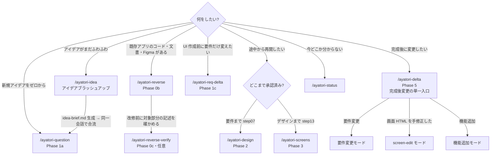
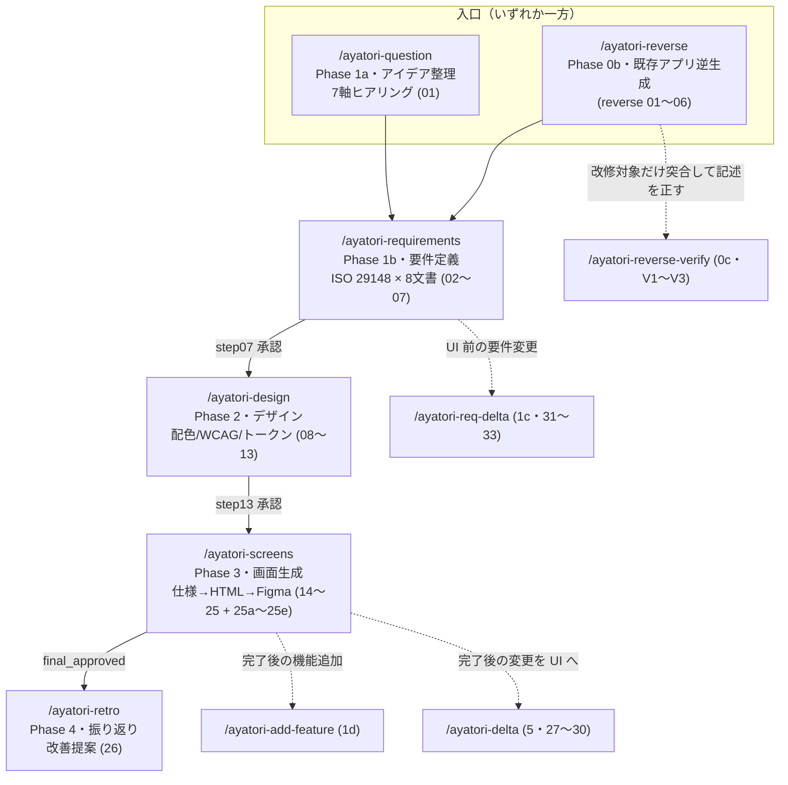
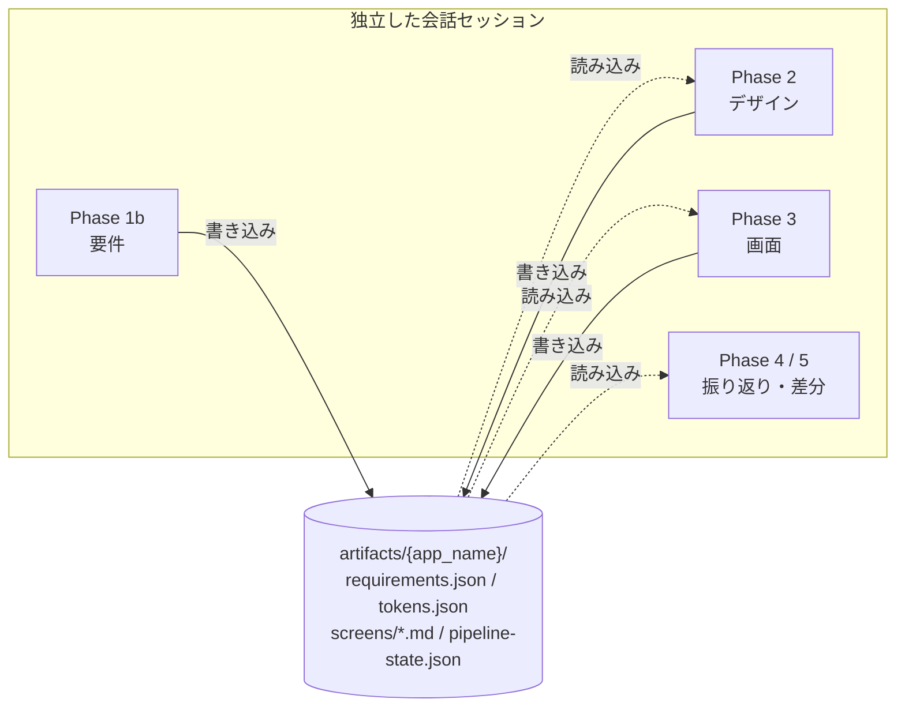
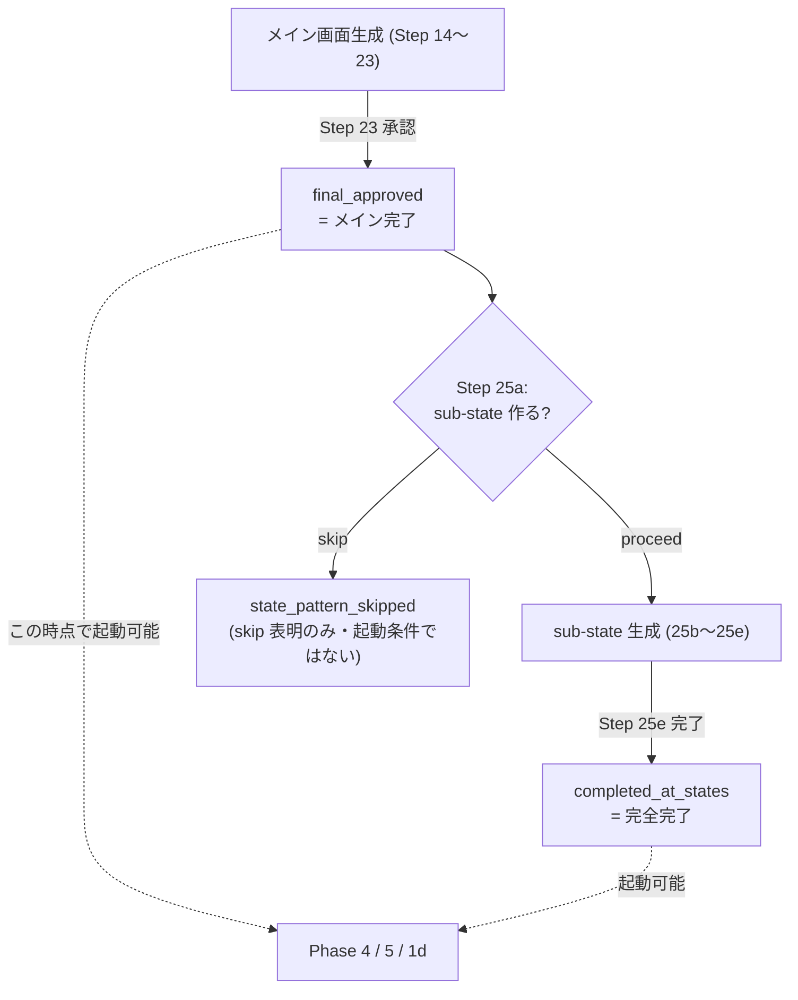

🌐 **日本語** | [English](ayatori-user-guide.en.md)

# AYATORI パイプライン 利用ガイド

> **AYATORI**（あやとり）— アイデアから UI 設計・画面仕様・デザインシステムまでを段階的に生成するパイプライン。

初めて使う方向けに「**どこから始めればよいか**」「**全体フロー**」「**各フェーズの役割**」をまとめています。
実行時の正本は常に [`pipeline.yaml`](../pipeline.yaml) / [`CLAUDE.md`](../CLAUDE.md) です。差異を見つけたら正本を優先してください。

---

## 目次

1. [どこから始める？（迷ったらここ）](#1-どこから始める迷ったらここ)
2. [全体フロー](#2-全体フロー)
3. [ユースケース別エントリーポイント](#3-ユースケース別エントリーポイント)
4. [フェーズ別リファレンス](#4-フェーズ別リファレンス)
5. [知っておくべき概念](#5-知っておくべき概念)
6. [よくある質問](#6-よくある質問)

---

## 1. どこから始める？（迷ったらここ）

あなたの状況に最も近い行を見て、対応するコマンドを実行してください。
**通常の新規開発は `/ayatori-question` から**始めます。今どこにいるか分からないときは `/ayatori-status` が現在地と次の推奨アクションを教えてくれます。

| あなたの状況 / やりたいこと                   | コマンド                   |
|-----------------------------------|------------------------|
| ゼロから新しいアプリのアイデアを形にしたい（最も一般的な起点）   | `/ayatori-question`    |
| アイデアがまだふわふわ・壁打ちして固めたい             | `/ayatori-idea`（固まったら同一会話でそのまま 7 軸へ合流） |
| 既存アプリの資料がある — コード・文書・Figma（リバースしたい）  | `/ayatori-reverse`     |
| リバースで起こした要件・画面仕様が実物と合っているか、改修する部分だけ確かめたい | `/ayatori-reverse-verify` |
| 要件は承認済み。デザインから始めたい                | `/ayatori-design`      |
| デザインは承認済み。画面生成から始めたい              | `/ayatori-screens`     |
| UI を作る前に、要件だけ変更したい                | `/ayatori-req-delta`   |
| 完成後に変更したい（要件変更 / 画面手修正 / 機能追加）      | `/ayatori-delta`（完成後変更の単一入口） |
| 画面 HTML をパイプライン外で手修正した → 画面仕様へ反映したい（要件と食い違う変更はゲートで「要件に昇格」を選ぶと要件定義書まで反映される） | `/ayatori-delta`（screen-edit モード） |
| 完成済みプロジェクトに機能を追加したい（ヒアリングから）      | `/ayatori-add-feature`（または `/ayatori-delta` の機能追加モード） |
| 社外共有・納品用の自己完結ドキュメントが欲しい           | `/ayatori-export`      |
| 全成果物を 1 画面でまとめて確認したい（要件・画面・デザイン・採点）  | `/ayatori-index`       |
| 行動変容・ナッジ設計の相談をしたい（ChargeMinder）   | `/ayatori-cm-consult`  |
| 今どこまで進んだか分からない / 次に何をすべきか         | `/ayatori-status`      |

### 入口の選び方（決定木）

---

## 2. 全体フロー

本流は **入口 → 要件 → デザイン → 画面 → 振り返り** の一方向です。各フェーズは独立した会話で実行し、**フェーズ間の連携は `artifacts/{app_name}/` 配下のファイル経由**でのみ行われます（直接の状態共有はしません）。

### 変更・差分系（要件変更 / 完了後の更新）

| コマンド                   | Phase / Step | 用途                                |
|------------------------|--------------|-----------------------------------|
| `/ayatori-reverse-verify` | 0c (V1〜V3) | リバース産記述の対象限定突合（記述を正すだけ。要件は変えない）    |
| `/ayatori-req-delta`   | 1c (31〜33)   | 要件レベルの変更（UI 未作成）を8文書に伝播           |
| `/ayatori-add-feature` | 1d (01b)     | 完了後の機能追加を7軸ヒアリング → 差分へ接続          |
| `/ayatori-delta`       | 5 (27〜30)    | 完了後変更の単一入口（要件変更 / 画面手修正 / 機能追加）。変更画面だけ部分再生成＋該当 Figma だけ更新 |
| `/ayatori-delta-mini`  | 6 (34)       | delta / req-delta 実行の軽量振り返り       |

### 補助・独立コマンド（いつでも実行可）

| コマンド                  | 用途                          |
|-----------------------|-----------------------------|
| `/ayatori-status`     | 進捗ダッシュボード・次アクション推奨          |
| `/ayatori-export`     | 配布用の自己完結 HTML 生成 (35・任意)    |
| `/ayatori-index`      | 全成果物を 1 つの index.html に集約（左目次+右プレビュー・任意） |
| `/ayatori-cm-consult` | ChargeMinder コンサル（独立・本流へ合流） |
| `/ayatori-idea`       | アイデアブラッシュアップ（独立・idea-brief.md を生成して同一会話で Phase 1a へ合流） |

> **ポイント:** 各フェーズは前フェーズの完了を `pipeline-state.json` の承認/完了フラグ（`approvals.*` など）で確認します。途中のフェーズから始める場合（Standalone 実行）は、必要なフラグが立っている必要があります（次章の入口条件を参照）。

---

## 3. ユースケース別エントリーポイント

| あなたの状況 / やりたいこと        | 入るフェーズ   | コマンド                   | 入口条件                                                                     |
|------------------------|----------|------------------------|--------------------------------------------------------------------------|
| 新規アイデアをゼロから開発したい       | Phase 1a | `/ayatori-question`    | なし（起点）                                                                   |
| 既存アプリの資料から要件を起こしたい      | Phase 0b | `/ayatori-reverse`     | 実コード (`input-sources/{stack}/` に配置) / 文書 (Confluence ID・Jira 課題キーを答える or `input-sources/docs/`) / Figma URL を答える のいずれか。渡し方は種類で違う → [§5](#5-入力既存コード文書figmaの渡し方) |
| リバース産の記述を改修対象だけ確かめたい     | Phase 0c | `/ayatori-reverse-verify` | リバース完走済（`requirements.json.status == REVERSE_ENGINEERED` + `requirements/01-08.md` + `screens/00-screen-list.md` が実在） |
| 要件承認済み、デザイン工程へ         | Phase 2  | `/ayatori-design`      | `step07_approved_at`                                                     |
| デザイン承認済み、画面工程へ         | Phase 3  | `/ayatori-screens`     | `step07_approved_at` + `step13_approved_at`                              |
| UI 未作成で要件を変更したい        | Phase 1c | `/ayatori-req-delta`   | `step07_approved_at`                                                     |
| 完成済みプロジェクトに機能追加        | Phase 1d | `/ayatori-add-feature` | `final_approved` / `completed_at_states`、または `baseline_approved_at`（reverse 基線） |
| 完成済みの変更を UI/Figma まで反映 | Phase 5  | `/ayatori-delta`       | `final_approved` / `completed_at_states`、または `baseline_approved_at`（reverse 基線） |
| 本流完了後の振り返り             | Phase 4  | `/ayatori-retro`       | `final_approved` または `completed_at_states`                               |
| 差分/要件差分実行の振り返り         | Phase 6  | `/ayatori-delta-mini`  | 完了済み（または `baseline_approved_at`）＋未振り返りの delta/req-delta run あり              |
| 配布物（自己完結 HTML）を作る      | 独立       | `/ayatori-export`      | Phase 3 最終承認後（任意・いつでも）                                                   |
| 全成果物を 1 画面で確認したい        | 独立       | `/ayatori-index`       | `artifacts/{app_name}/` があればいつでも（部分実行でも可）                              |
| 進捗確認・現在地の把握            | —        | `/ayatori-status`      | なし（いつでも）                                                                 |

---

## 4. フェーズ別リファレンス

| コマンド                    | Phase     | Step            | 役割                                                     | 主な出力 / 入口条件                                  |
|-------------------------|-----------|-----------------|--------------------------------------------------------|----------------------------------------------|
| `/ayatori-question`     | 1a        | 01              | 7軸ヒアリングでアイデアを構造化（デザイン出力範囲も決定）。`idea-brief.md` があればブリーフ先読みモードで確認から開始 | 出力: `requirements.json`                      |
| `/ayatori-reverse`      | 0b (代替入口) | reverse 01〜06         | 既存アプリのコード・文書（Confluence/Jira/ローカル）・Figma を突合して要件化（1a+1b を代替。コード不在時は Figma 中心の縮退モード）              | 出力: `requirements.json (REVERSE_ENGINEERED)` |
| `/ayatori-reverse-verify` | 0c (任意・反復) | verify V1〜V3        | 改修対象として指定した機能・画面の関連範囲だけを実コード・文書アーカイブ・Figma capture と突合し、食い違いを人間確認のうえ記述へ反映（コードの読み違いを改修前に潰す）。コード修正・要件変更・全範囲突合はスコープ外 | 入口: リバース完走済 / 出力: `reverse-verify/crosscheck-report.md` + 訂正済み `requirements/*.md` |
| `/ayatori-requirements` | 1b        | 02〜07           | ISO 29148 の8文書生成＋ルーブリック採点ループ＋Confluence 保存＋人間承認        | 出力: `requirements/01-08.md`                  |
| `/ayatori-req-delta`    | 1c        | 31〜33           | UI 作成前の要件レベル変更を8文書全体に伝播                                | 入口: `step07_approved_at`                     |
| `/ayatori-add-feature`  | 1d        | 01b             | 完了済みプロジェクトへの機能追加を7軸ヒアリング → 差分へ接続                       | 入口: `final_approved` / `completed_at_states` / `baseline_approved_at` |
| `/ayatori-design`       | 2         | 08〜13           | 配色 OKLCH 導出→WCAG 検証→サンプル HTML×3→人間選択→3層トークン→承認         | 出力: `tokens.json` / `style-guide`            |
| `/ayatori-screens`      | 3         | 14〜25 + 25a〜25e | 画面仕様→HTML→レビュー→Figma→最終承認→DS更新→コンポーネント生成→（任意）sub-state。**reverse 経路のプロジェクトは入口で「基線確立（screens-lite）」も選べます**（下記） | 入口: `step07_approved_at` + `step13_approved_at` |
| `/ayatori-retro`        | 4         | 26              | 成果物レビュー＋フィードバック分析＋パイプライン改善提案                           | 入口: 本流完了（`final_approved` 等）                 |
| `/ayatori-delta`        | 5         | 27〜30           | 完了後の要件変更を、変更画面だけ部分再生成＋該当 Figma フレームだけ更新                | 入口: `final_approved` / `completed_at_states` / `baseline_approved_at` |
| `/ayatori-delta-mini`   | 6         | 34              | delta / req-delta 実行に対する軽量振り返り                         | 入口: 完了済み（または `baseline_approved_at`）＋未振り返りの delta/req-delta run あり |
| `/ayatori-export`       | —         | 35              | 画面/要件を画像 base64 埋め込みの自己完結 HTML に結合（社外共有・納品用）           | 入口: Phase 3 完了後・任意                           |
| `/ayatori-index`        | —         | index           | 全成果物（要件・画面・デザイン・採点・監査）を 1 つの index.html に集約（左目次+右iframe/MD）  | 入口: `artifacts/{app_name}/` があればいつでも      |
| `/ayatori-status`       | —         | —               | 全 AYATORI プロジェクトの進捗ダッシュボード＋次アクション推奨                    | 入口: いつでも                                     |
| `/ayatori-cm-consult`   | —         | —               | 行動変容ゴールからナッジ理論ベースの打ち手提案＋検証設計＋要件の種を生成 → 本流へ合流           | 入口: 明示起動のみ（phase_order 非搭載）                  |
| `/ayatori-idea`         | —         | 01a             | 発散→収束→具体化の育成ループ（最大3周）でアイデアを固め idea-brief.md を生成 → 同一会話で 1a のブリーフ先読みモードへ合流（中断時は 1a が自動検出） | 入口: 明示起動のみ（phase_order 非搭載）/ 出力: `idea-brief.md` |

---

## 5. 知っておくべき概念

### 1. フェーズは独立した会話で動く
各フェーズは別々の会話セッションで実行します。フェーズ間の情報受け渡しは `artifacts/{app_name}/` 配下の JSON/MD ファイルだけで行われます。会話をまたいでも、ファイルが残っていれば続きから進められます。

### 2. 人間ゲート（承認ポイント）がある
Step 07（要件）/ 13（デザイン）/ 23（画面最終）などに人間の承認ゲートがあります。承認すると `pipeline-state.json` に承認時刻が記録され、次フェーズの入口条件になります。承認時に修正指示を返すと、その内容が反映されてやり直します。

### 3. 二段階完了モデル（Phase 3）
Phase 3 は2段階で「完了」します。

- `final_approved` … メイン画面 HTML 完了
- `completed_at_states` … empty / loading / error 等の sub-state まで含めた完全完了
- `screens.state_pattern_skipped` … sub-state を作らない選択をした印（完了後フェーズの起動条件ではない。skip 時も `final_approved` が立っている）

完了後フェーズ（1d / 4 / 5 / 6）は `final_approved` または `completed_at_states` を入口条件にします（`state_pattern_skipped` 単独は起動条件ではありません）。reverse 経路のプロジェクトは、ベースライン承認印 `baseline_approved_at` でも 1d / 5 / 6 に入場できます（4 retro は不可 — SoT は CLAUDE.md § 完走後 Phase 共通 Entry Guard）。この入場は **reverse 経路専用**で、`requirements.json.status == "REVERSE_ENGINEERED"` を併せて検査します（forward 経路のプロジェクトに手動でこの印を書いても入場できません）。

**ベースライン承認印はどこで押すか（screens-lite ルート）**: reverse 経路のプロジェクトで `/ayatori-screens` を実行すると、入口で「基線確立（screens-lite）」と「フル実行（従来）」を選べます。基線確立を選ぶと画面 HTML は作らず、変更コマンドが必要とする材料（遷移図と派生ビュー、共通部品の正典）だけを整えて、出口の人間ゲートで `baseline_approved_at` を押印します（`final_approved` は立ちません = 画面レビューは未実施）。reverse 直後に機能追加や差分を回したい場合の推奨ルートです。画面 HTML まで作りたくなったら、あとから `/ayatori-screens` を再実行して「フル実行」を選べます。

### 4. 現在地は `/ayatori-status` で確認
「どのフェーズまで終わったか」「次に何をすべきか」が分からなくなったら、まず `/ayatori-status`。これが唯一の進捗ダッシュボードです。

### 5. 入力（既存コード・文書・Figma）の渡し方
リバース（`/ayatori-reverse`）で既存アプリを読ませる場合、**渡し方はソースの種類で違います**:

| ソース | 渡し方 | 事前準備 |
|---|---|---|
| **既存ドキュメント** (Confluence) | 実行中に**親ページ ID / URL を答えるだけ** — Step 01 が取得して `ground-truth/` にアーカイブ | 不要（ID を手元に用意するだけ） |
| **Jira 課題** | 実行中に**課題キー / URL を答えるだけ** — Step 01 が取得して `ground-truth/jira-{KEY}.md` に正規化（課題は「ある時点の変更要求」の記録として突合の裏取りに使う） | 不要（課題キーを手元に用意するだけ） |
| **Figma** | 実行中に **file / frame の URL を答えるだけ** — Step 01 が capture して `ground-truth/figma/` にアーカイブ | 環境変数 `FIGMA_MCP_ENABLED=true`（未設定だとこのソースは使えません） |
| **ローカル文書** (md / txt / pdf) | `artifacts/{app_name}/input-sources/docs/` に置く（Step 01 が引用できる形へ正規化） | ファイル配置 |
| **ソースコード** | `artifacts/{app_name}/input-sources/{stack}/` に置く（例: `input-sources/ios-swift/`, `input-sources/kmp/`）。repo URL を伝えた場合は**パイプラインが取得コマンドを組み立てて提示**するので、それを実行して配置する | 配置（URL を渡すだけでは読まれません） |

**なぜコードだけ配置が必要か**: 解析にはトリー全体が必要で、パイプラインは `git` 等の外部コマンドに依存しない設計（環境を選ばず動くため）です。URL が記録されていてもファイルが実在しない限り「コードあり」とは扱いません。

あるものを全部渡すほど突合精度が上がります。ソースコードが無い場合は Figma を中心にした縮退モードで要件・画面仕様を起こせます（根拠が弱くなるためレビューゲートでの確認がより重要になります）。

---

## 6. よくある質問

**Q. とりあえず試したい。何を打てばいい？**
A. 新規アイデアなら `/ayatori-question`。既存アプリの資料（コード・文書・Figma）があるなら `/ayatori-reverse`。迷ったら `/ayatori-status`。

**Q. 要件だけ作って、デザイン以降は別途やりたい**
A. `/ayatori-question` → `/ayatori-requirements` で止めれば OK。後日 `/ayatori-design` から再開できます（`step07_approved_at` が立っていれば）。

**Q. 途中のフェーズから単独で始められる？**
A. はい（Standalone 実行）。ただし対応する承認フラグが `pipeline-state.json` に必要です。[③ の入口条件](#3-ユースケース別エントリーポイント)を参照してください。

**Q. `/ayatori-*` 以外のコマンド（例: `/kairo-*`）を打ってしまった**
A. AYATORI はパイプライン外コマンドを検知して停止し確認します（外部コマンド混入の検知）。正規コマンドは ③・④ に列挙した `/ayatori-*` のみです。

**Q. 完成後に仕様を変えたくなった**
A. 完成後の変更は `/ayatori-delta` が単一入口です。入口で起点（要件変更 / 画面 HTML を手修正した / 機能追加）を選ぶと、それぞれのモードに進みます。まだ UI を作っていない段階で要件だけを変えたいときは `/ayatori-req-delta` を使います。

---

> **出典:** 本ガイドの内容は [`pipeline.yaml`](../pipeline.yaml)（phase_order / command_policy）と [`CLAUDE.md`](../CLAUDE.md)（Pipeline Execution / Standalone Phase 実行 / 二段階完了モデル）に基づきます。
