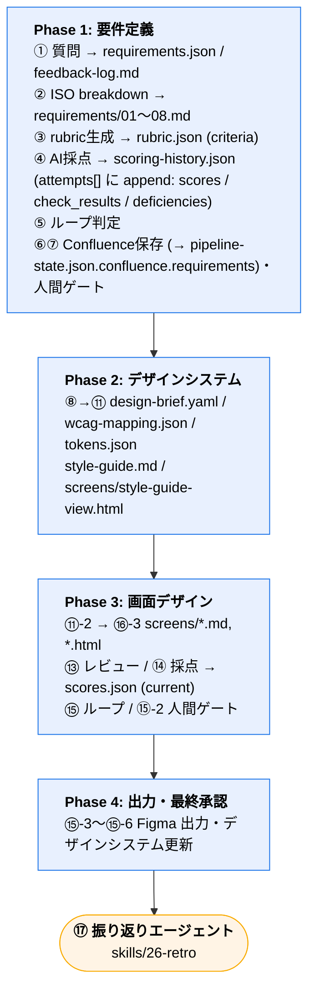
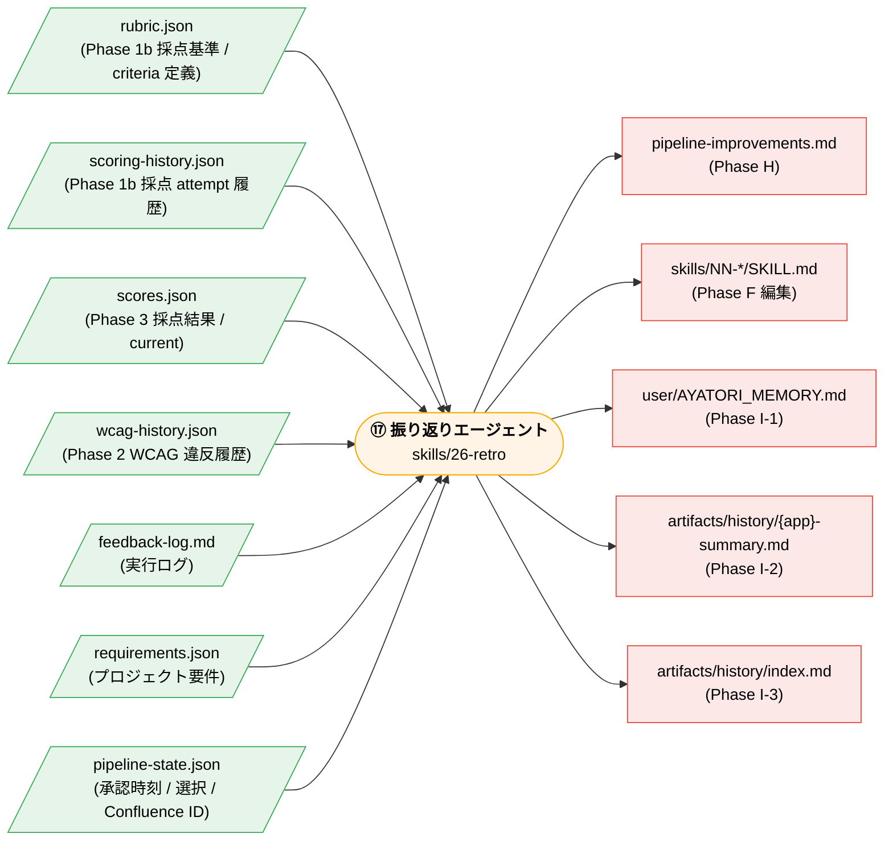

# ⑰ 振り返りエージェント — データパイプライン仕様

> ⑰ 振り返りエージェント (= 通しNO. 26 = `skills/26-retro/`) が消費・生成するデータの一元仕様。
> 「結果・ログが一元管理され、分析可能な状態」 を満たすための設計ドキュメント。

---

## 0. 用語と参照先

| 用語 | 意味 |
|---|---|
| `⑰ / Pipeline ID` | PoC 1 次トライアルで定義された動的 ID。⑰ = 振り返りエージェント (固定意味)。 |
| `通しNO.` | 現行 `pipeline.yaml` の step 順序番号。⑰ = 通しNO. 26 = `skills/26-retro`。 |
| `Phase A〜I` | `skills/26-retro/SKILL.md` 内のフェーズ。Phase A=入力読込、Phase H=レポート、Phase I=履歴書込。 |

参照ドキュメント：

- `pipeline.yaml` (single source of truth、phase / step / loop / gate 定義)
- `skills/26-retro/SKILL.md` (⑰ の挙動)
- `skills/00-memory-write/SKILL.md` (Phase I の処理)
- `CLAUDE.md` 「Feedback Log」 セクション (`feedback-log.md` の運用ルール)
- AYATORI Specification (Confluence [3740237924](https://kinto-dev.atlassian.net/wiki/spaces/mord/pages/3740237924))

---

## 1. データフロー全体像

### 1.1 パイプライン全体フロー

### 1.2 ⑰ 振り返りエージェントの入出力

---

## 2. ⑰ の入力データ仕様

### 2.1 `rubric.json` + `scoring-history.json` — Phase 1 要件定義採点

- 仕様: [`schemas/rubric.schema.json`](../../schemas/rubric.schema.json) (criteria 定義のみ) / [`schemas/scoring-history.schema.json`](../../schemas/scoring-history.schema.json) (attempt 履歴)
- 生成: ③ rubric 生成 → criteria を `rubric.json` に書込 / ④ AI 採点 → `scoring-history.json.attempts[]` に 1 件 append
- ⑰ での使用:
  - **Phase D 数値サマリー**: `scoring-history.json.attempts[-1].total`、`attempt_count = len(attempts) - 1`、`escalated` は導出
  - **Phase B パターン分析**: `scoring-history.json.attempts[-1].deficiencies[].tag` / `.axis` / `.severity`
  - **Phase D「AI 単独で防げた件数」**: `scoring-history.json.attempts[-1].ai_improvable_count`

### 2.2 `scores.json` — Phase 3 デザイン採点結果

- 仕様: [`schemas/scores.schema.json`](../../schemas/scores.schema.json)
- 生成: ⑭ ルーブリック採点 (`skills/19-rubric-score`) が `current` (full snapshot) を上書き + `history[]` に lightweight summary を push (1 行サマリのみ、full attempt 構造は保持しない)
- ⑰ での使用:
  - **Phase D**: `current.total`, `attempt_count`, `escalated`, layer 別スコア
  - **Phase B**: `current.tags[].type` で AI / 人間別分類
  - **Phase C 改善提案**: `current.tags[].item` を起点に skills/NN-*/SKILL.md の追加箇所を逆引き

### 2.3 `feedback-log.md` — パイプライン実行ログ

- 仕様: [`schemas/feedback-log.schema.md`](../../schemas/feedback-log.schema.md)
- 生成: 全 step 共通 (CLAUDE.md ルール 6 で明示。3 パターン発生時に即追記)
- ⑰ での使用:
  - **Phase A 学習収集 (最重要)**: 全エントリ読込
  - **Phase B**: 各エントリの `[NN]` から原因 step を、`PatternX` から欠陥種別を判定
  - **Phase C**: エントリの「原因」と「即時の対応」から、再発防止のための SKILL.md 追記内容を逆生成

> 空ファイル (ヘッダのみ) または存在しない場合、`skills/26-retro/SKILL.md` Phase A の警告分岐に入る。

### 2.4 `requirements.json` + `pipeline-state.json` — プロジェクト要件 (INPUT) + 状態 (OUTPUT)

- 仕様: [`schemas/requirements.schema.json`](../../schemas/requirements.schema.json) (要件の純粋な記述) / [`schemas/pipeline-state.schema.json`](../../schemas/pipeline-state.schema.json) (cross-phase hot state)
- ⑰ での使用:
  - **Phase 0 成果物確認**: `pipeline-state.json.confluence.requirements.doc_page_ids`, `pipeline-state.json.confluence.design.doc_page_ids` から URL を組み立てて表示
  - **Phase H レポート冒頭**: `requirements.json` の `app_name` / `created_at`

---

## 3. ⑰ の出力データ仕様

### 3.1 `artifacts/{app_name}/pipeline-improvements.md`

ユーザー向けサマリー (Confluence 共有可) と エンジニア向け詳細 (内部記録のみ) の二部構成。`skills/26-retro/SKILL.md` Phase H を参照。

スキーマ化はせず、テンプレートを `skills/26-retro/SKILL.md` 内に保持。

### 3.2 `skills/NN-*/SKILL.md` (編集系)

⑰ Phase F が承認済み改善提案を Edit ツールで該当 skill に適用。出力ではなくパイプライン自体の改善 (= ⑰ の主目的)。

### 3.3 `user/AYATORI_MEMORY.md`

ユーザー横断の好み・環境設定。`skills/00-memory-write/SKILL.md` Step I-1 で append。

### 3.4 `artifacts/history/{app_name}-summary.md` & `artifacts/history/index.md`

- 仕様: [`schemas/history-summary.schema.md`](../../schemas/history-summary.schema.md)
- 生成: `skills/00-memory-write/SKILL.md` Step I-2 / I-3
- 用途: 次回類似アプリ実行時に `skills/00-memory-load` がカテゴリ単位で参照

---

## 4. データの一元化方針

### 何を「一元」と定義するか

⑰ の完了条件「結果・ログが一元管理され、分析可能な状態」 を以下の 3 観点で満たす：

| 観点 | 実装 |
|---|---|
| **入力の一元** | `artifacts/{app_name}/` 配下に rubric.json / scoring-history.json / scores.json / feedback-log.md / requirements.json / pipeline-state.json / wcag-mapping.json / wcag-history.json を集約。全 step が同一ディレクトリへ書き込む。 |
| **形式の一元** | 本ドキュメントから [`schemas/`](../../schemas/) を参照可能。各 SKILL.md は出力時に schema 準拠を強制 (validate スクリプトは将来課題)。 |
| **時系列の一元** | クロスプロジェクトは `artifacts/history/index.md` (1 行 = 1 プロジェクト)、プロジェクト内ループは `scoring-history.json.attempts[]` (Phase 1b) / `wcag-history.json.attempts[]` (Phase 2) で表現。Phase 3 scores.json は最新 attempt の full snapshot を `current` に + 過去 attempt の lightweight summary (1 行 / attempt) を `history[]` に保持 (Phase 1b / 2 のような full attempt 履歴は持たず、retrospective view 用の 1 行サマリのみ)。 |

### 「分析可能」の意味

- ⑰ が **1 つのコンテキストで全入力を読み切れる** (現状: rubric.json ≤ ~10KB, scoring-history.json ≤ ~30KB, scores.json ≤ ~10KB, feedback-log.md ≤ ~200 entries で十分)
- 改善提案を **skills/NN-*/SKILL.md にトレースできる** ( `feedback-log.md` の `[NN]` 起点 + `scoring-history.json.attempts[-1].deficiencies[].axis` / `scores.json.current.tags[].item` から逆引き)
- 過去プロジェクトとの **比較が可能** (`artifacts/history/index.md` のテーブル + `*-summary.md`)

---

## 5. 既知の限界と将来課題

初版実装のスコープ外：

| 項目 | 理由 / 次回検討 |
|---|---|
| JSON Schema validate スクリプト | 現状はドキュメントによる規約。CI 連携は別チケット。 |
| feedback-log.md パーサ | LLM が直接読むため自然言語で十分。集計が必要になったら別チケット。 |
| 横断ダッシュボード (全プロジェクトの可視化 HTML) | `index.md` の markdown テーブルで運用上充足。可視化要望が出たら別チケット。 |
| `analysis-input.json` (3 入力統合 JSON) | ⑰ の LLM が 3 ファイル直接読みで十分機能。冗長化は避ける。 |

---

## 6. 変更管理

本ドキュメントと `schemas/*` の変更は以下の順序：

1. `pipeline.yaml` または `skills/NN-*/SKILL.md` の出力構造を変える際は、**先に schema を更新** してから SKILL.md を更新する。
2. schema を変えたら本ドキュメント section 2/3 のリンク先と用例を確認。
3. PR 説明に「schema breaking change: ✅/❌」を明記する (既存 artifacts/{app_name}/ との互換性)。
