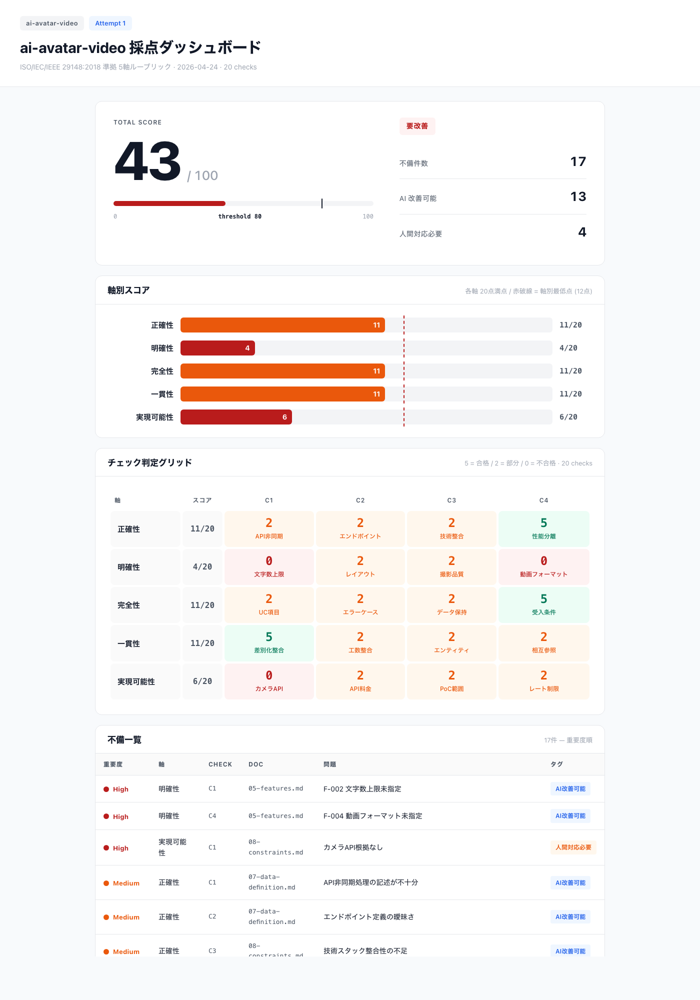

# 採点ガイド — 基準・フロー・結果の見方

## 採点ダッシュボード例



> ④ が採点するたびに `artifacts/{app_name}/scoring-dashboard.html` として自動生成される。
> 軸別バーチャート・Check 判定マップ・Deficiency 一覧・ギャップ分析を1画面で確認可能。

### Web で見る

④ が採点するたびに以下の HTML を `artifacts/{app_name}/` に自動生成する。ブラウザで直接開いて確認可能。

```
open artifacts/{app_name}/scoring-dashboard.html   ← 今回の採点結果
open artifacts/{app_name}/scoring-history.html     ← 全回分の推移
```

---

## 採点基準

ISO/IEC/IEEE 29148:2018（要件品質の国際標準）をベースに5軸で採点する。

| 軸 | ISO 29148 | 評価内容 | 配点 |
|---|---|---|---|
| 正確性 (correctness) | Correctness | 要求事項と解決策が一致しているか | 20点 |
| 精密性 (unambiguity) | Unambiguity | 数値・仕様が具体的か、曖昧語がないか | 20点 |
| 完全性 (completeness) | Completeness | 漏れがないか（エラー・例外含む）| 20点 |
| 一貫性 (consistency) | Consistency | ドキュメント間に矛盾がないか | 20点 |
| 実現可能性 (feasibility) | 独自軸 | 期間・技術・体制で実現可能か | 20点 |
| **合計** | | | **100点（合格: 80点）** |

> 上位4軸は ISO 29148 から直接採用。5番目は AYATORI 独自軸。

---

## 採点構造 — sub-rubric checks

各軸20点を **4つの具体的な check** に分解して採点する。

```
各軸 (20点)
  ├ check C1 (5点) → yes(5) / partial(2) / no(0)
  ├ check C2 (5点) → yes(5) / partial(2) / no(0)
  ├ check C3 (5点) → yes(5) / partial(2) / no(0)
  └ check C4 (5点) → yes(5) / partial(2) / no(0)
```

| verdict | 意味 | 点数 |
|---|---|---|
| yes | 完全に満たされている | 5 |
| partial | 過半数は満たされているが不足あり | 2 |
| no | 満たされていない / 記述がない | 0 |

check は **③ ルーブリック生成**（`skills/03-rubric-gen/SKILL.md`）がアプリごとに自動生成する。汎用テンプレートではなく、アプリ固有の質問になる。

---

## いつ採点されるか

```
② 要件生成
  ↓
③ ルーブリック生成（checks を含む rubric.json を出力）
  ↓
④ 採点（check 単位で判定 → スコア合算 → HTML レポート生成）  ← ここ
  ↓
⑤ ループ判定
```

④（`skills/04-scoring/SKILL.md`）が実行されるたびに採点される。

---

## 不合格時のフロー — 全体像

```
④ 採点: 69点（80点未満）
  │
  │  scoring-history.json.attempts[] に 1 件 append:
  │    { attempt_count: N, timestamp: ISO-8601,
  │      scores:        { correctness: 17, unambiguity: 9, ... },
  │      total:         69,
  │      check_results: [ { check_id: "unambiguity-C2", verdict: "no", evidence: "..." }, ... ],
  │      deficiencies:  [ { axis: "unambiguity", doc: "05-features.md",
  │                         issue: "API仕様が未定義", check_id: "unambiguity-C2" }, ... ] }
  │
  ↓
⑤ ループ判定 (skills/05-loop-req/SKILL.md)
  │  scoring-history.json.attempts[-1] を読み込む
  │
  ├─ attempts[-1].total >= 80 → 合格 → ⑥ Confluence 保存へ
  ├─ len(attempts) >= 3 → エスカレーション → ⑦ 人間判断へ
  └─ それ以外 → ② へ差し戻す（次回 ④ が新 attempt を append。attempt_count は配列 index から導出）
  │
  ↓
② ISO 29148 要件昇華 (skills/02-iso-breakdown/SKILL.md)
  │  scoring-history.json.attempts[-1].deficiencies を読み込み、以下の3フィールドで修正箇所を特定:
  │
  │    doc:      → どのファイルに問題があるか（例: 05-features.md）
  │    issue:    → 何が不足しているか（例: API仕様が未定義）
  │    check_id: → どの check が不合格か（例: unambiguity-C2）
  │
  │  → 該当ファイルの該当箇所を重点的に修正・補完
  │  → requirements/01-overview.md 〜 08-constraints.md を上書き保存
  │
  ↓
③ ルーブリック生成 (skills/03-rubric-gen/SKILL.md)
  │  scoring-history.json.attempts[-1].deficiencies を読み込み、checks に反映:
  │
  │    例: deficiency { check_id: "unambiguity-C2", issue: "API仕様が未定義" }
  │    → unambiguity-C2 の question を具体化:
  │      旧: 「APIのエンドポイント仕様が定義されているか」
  │      新: 「前回未定義だった音声プレビューAPI（Starfish TTS）の
  │           エンドポイント・パラメータ・レスポンスが今回追記されているか」
  │
  │  → rubric.json の criteria（checks 含む）を更新（初回のみ書込、以降不変）
  │
  ↓
④ 再採点
  │  更新された checks で再判定
  │  前回 no だった check が yes に変わっていれば +5点
  │
  ↓
⑤ 再度ループ判定 → 80点以上なら合格 → ⑥へ
```

### ループの実例（3回で合格するケース）

```
Attempt 1: 69点（不合格）
  deficiencies: 9件（high 3 / medium 4 / low 2）
  ② が high 3件を重点修正
    ↓
Attempt 2: 79点（不合格）
  deficiencies: 4件（high 1 / medium 2 / low 1）
  ② が残りの high 1件を修正
    ↓
Attempt 3: 87点（合格）
  deficiencies: 3件（high 0 / medium 2 / low 1）
  → ⑥ Confluence 保存へ
```

### 各ステップが rubric.json で連携する仕組み

rubric.json が **全ステップ間の唯一の通信手段** となる。

| ステップ | rubric.json の読み書き |
|---|---|
| ③ ルーブリック生成 | **書く**: criteria（checks 含む）/ **読む**: deficiencies（ループ時） |
| ④ 採点 | **読む**: criteria.checks / **書く**: scores, total, check_results, deficiencies |
| ⑤ ループ判定 | **読む**: total, attempt_count / **書く**: attempt_count (+1), escalated |
| ② 要件修正 | **読む**: deficiencies（doc, issue, check_id で修正箇所を特定）|

→ deficiency に `doc`（どのファイル）・`issue`（何が不足）・`check_id`（どの check）の3つが揃っているため、② は「何を・どこで・どう直すか」を正確に把握できる。

---

## HTML レポート

④ が採点するたびに以下を自動生成する。

```
artifacts/{app_name}/
  ├ scoring-dashboard.html   ← 今回の結果（毎回上書き）
  ├ scoring-history.html     ← 全回分の推移（追記更新）
  └ scoring-history.json     ← 履歴データ
```

`open artifacts/{app_name}/scoring-history.html` でブラウザから閲覧可能。

---

## 結果の見方

### 1. 軸別バーチャート

5軸のスコアが横棒グラフで表示される。赤い点線が合格目安（各軸16点）。

- 棒が赤線より右 → その軸は問題なし
- 棒が赤線より左 → その軸に不足あり

### 2. Check ヒートマップ

5軸 × 4 checks のグリッド。各セルの色で仕様書の不足箇所が一目でわかる。

| 色 | 意味 | アクション |
|---|---|---|
| 🟢 **緑 (Y)** | 問題なし | 対応不要 |
| 🟡 **黄 (P)** | 一部だけ記述あり | 補完が必要 |
| 🔴 **赤 (N)** | 完全に欠落 | **最優先で修正** |
| 🟢 **緑枠** | 前回から改善された check | 修正が反映された証拠 |

### 3. セルクリック詳細

ヒートマップのセルをクリックすると下部パネルが表示される：

- **Check 質問**: 何を評価しているか（例: 「音声プレビューAPIの仕様が定義されているか」）
- **判定根拠**: なぜ yes/partial/no か（例: 「エンドポイントURL・パラメータが未記載」）
- **重要度**: high / medium / low

### 4. Deficiency 推移

attempt ごとの high/medium/low 件数がスタックバーで表示される。ループが進むにつれて件数が減っていくのが理想。

### 5. 履歴ダッシュボード（scoring-history.html）

複数回の採点結果を並べて表示：

- **スコア推移カード**: 69 → 79 → 87 のように合計点の変化
- **軸別比較バーチャート**: 各 attempt の5軸スコアを色分けして並列表示
- **Check ヒートマップ**: 全 attempt × 全 check で改善箇所を追跡

---

## 関連ファイル

| ファイル | 役割 |
|---|---|
| `skills/03-rubric-gen/SKILL.md` | ③ ルーブリック + checks 生成 |
| `skills/04-scoring/SKILL.md` | ④ check 単位採点 + HTML 生成 |
| `skills/05-loop-req/SKILL.md` | ⑤ ループ制御（80点判定） |
| `skills/04-scoring/refs/scoring-rubric-v0.1.md` | 各軸の段階別アンカー基準 |
| `skills/04-scoring/refs/ai-human-tag-rules-v0.1.md` | AI/人間タグ分類ルール |
| `skills/03-rubric-gen/refs/rubric.json` | rubric.json の構造テンプレート |
| `docs/interface-contracts.md` | rubric.json の JSON スキーマ定義 |
| `artifacts/{app_name}/scoring-dashboard.html` | ④ が自動生成する単回レポート |
| `artifacts/{app_name}/scoring-history.html` | ④ が自動生成する履歴レポート |
