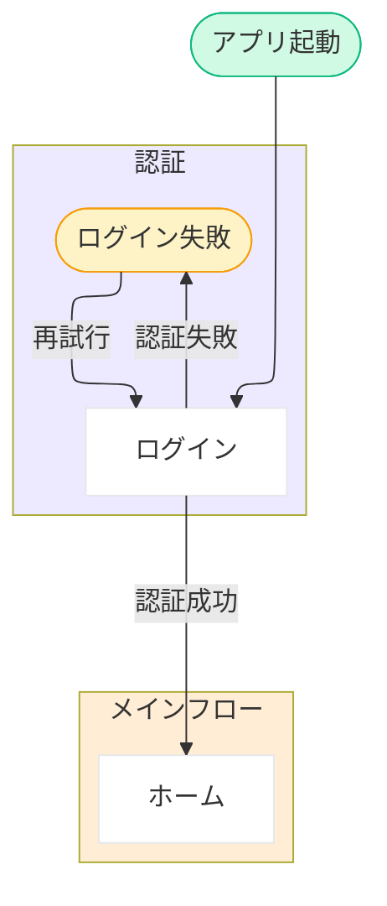

# 14 デザイン用ドキュメント生成（画面一覧・遷移図）

## 役割
全画面HTMLを生成する前に、画面一覧と画面遷移図を先に確定する。人間レビュー（16）で構成の妥当性を確認してから、17 で全画面HTMLを生成する。

## 前提条件
- `artifacts/{app_name}/requirements.json`（Must機能・スコープ）
- `artifacts/{app_name}/requirements/02-scope.md`・`05-features.md`
- `artifacts/{app_name}/design-brief.yaml`（`cases[selected_sample_id]` を参照）・`tokens.json`（参照）

---

## 事前チェック: REVERSE_ENGINEERED ファストパス

Phase orchestrator が `reverse_handoff_active = true` を設定済み **かつ**
`artifacts/{app_name}/screens/00-screen-list.md` が存在する場合:

- このステップ（Step 14）の画面一覧・遷移図生成を**スキップ**する
- Phase 0b の Step 06 が生成した既存 `screens/00-screen-list.md` をそのまま使用する
- **ただし `artifacts/{app_name}/screens/00-coverage-check.json` は Step 19 が read-only required input として参照するため、ファストパスでも「存在しない場合は」以下の「空 stub」を書き出す** (schema: `schemas/coverage-check.schema.json`):

  ```json
  {
    "coverage_check": {
      "checked_at": "<ISO8601 現在時刻>",
      "scope": "screen_list",
      "layers": {
        "l1_ui_states":      { "missing": [] },
        "l2_action_result":  { "missing": [] },
        "l3_flow_end":       { "missing": [] },
        "l4_content_replace":{ "missing": [] },
        "l5_connectivity":   { "defects": [] }
      },
      "summary": {
        "total_missing": 0,
        "by_classification": { "個別画面化": 0, "テンプレート代表1枚": 0, "DS吸収": 0 },
        "connectivity_defects": 0
      },
      "user_accepted_gaps": true
    }
  }
  ```

  `user_accepted_gaps: true` は「**L1〜L4 の早期チェックを実施していない経路由来** であることを示す印 = 後段 (Step 19 / 21) が安全網として再評価する」ことを明示するために記録する (L5 は `validate-connectivity` が機械検査する場合がある)。writer はファストパス / Phase 0b の Step 06 (E6) / 14-lite のいずれでもあり得るため、この印は「誰が書いたか」ではなく「L1〜L4 が未実施である」ことだけを意味する。

  **既存の `00-coverage-check.json` がある場合は stub を書かない** (Step 06 の E6 / 過去 run が記録した L5 defects や L1〜L4 の結果を空 stub で潰さないため)。代わりに L5 のみ refresh する — `--write` は `layers.l5_connectivity` / `summary.connectivity_defects` だけを patch し他の layer を保全する契約 (script ヘッダ参照):

  ```
  node scripts/validate-connectivity.mjs artifacts/{app_name} --write
  ```

  - **exit 0** = defect なし / **exit 1 = defect あり (正常系。Step 16 の確認リスト)** / **exit 2** = 運用エラー → 警告を記録して続行
  - **実行順**: 先に下記「遷移図 SSoT の確保」を済ませてから実行する (`.mmd` が無いと exit 2 になるため)。`.mmd` を用意できなかった場合は本コマンドを実行しない
  - **遷移図 SSoT の確保 + L5 派生ビュー**: ファストパスでも `00-transition-map.mmd` (SSoT) は必要 — Step 16 の人間レビュー材料であり、Step 19 採点と Phase 5 delta (Step 28 影響分析) が遷移グラフを読む。リバース経路では Phase 0b の Step 06 (E6) が生成済のはずだが、**「有る」前提で素通りせず次の順で確保する**:

    1. `.mmd` が存在する → **そのまま使う** (再生成しない。Step 16 で人間が手修正した内容を潰さないため)
    2. `.mmd` 不在 かつ `artifacts/{app_name}/requirements/03-user-flow.md` が存在する → **salvage 生成する** (Step 06 の E6 が未実施 / fail-open した run の救済。変換は決定論 script で行い、AI は Mermaid を書き起こさない):

       ```
       node scripts/derive-transition-map.mjs artifacts/{app_name}
       ```

       - **exit 0** = 生成成功 (stdout summary の `nodes` / `edges` / `folded_diamonds` / `warnings[]` を控える)
       - **exit 1** = 使い方エラー (呼び出し側のバグ) → **skip せず停止**して stderr をそのまま表示する
       - **exit 2** = 入力不能 (mermaid ブロック 0 件 等) → 下記 3 と同じ扱い (警告表示 + skip)
       - `--force` は渡さない (既存 `.mmd` を上書きしないのが script の既定 = 上記 1 と二重の保護)
    1'. **上記 1 (既存 `.mmd` をそのまま使う) の場合も警告を拾う**: `screens/00-transition-map.derive-summary.json`
       (sidecar) があれば Read し、`summary.warnings[]` の `unparsed_line` 件数を Step 16 の提示に含める
       (`.mmd` を生成した run の警告はここにしか残らない)。`mmd_md5` 不一致なら「生成時点の情報」と添え、
       sidecar 不在なら「不明 (sidecar 未生成)」と書く (**推測で 0 件と書かない**)
    3. `.mmd` 不在 かつ source (`requirements/03-user-flow.md`) も不在 → `.mmd` / `nav.json` の生成をスキップし「⚠️ 遷移図がありません (Step 16 のレビュー材料と L5 検証は skip)」と警告表示する
    4. `.mmd` が用意できたら派生ビューを生成する (Step 5-1 の導出規則は下記 script が単一の変換 SoT):

       ```
       node scripts/derive-screen-nav.mjs artifacts/{app_name}
       ```

       - **exit 0** = `00-screen-nav.json` 生成成功。stdout summary の `screen_list_warnings` / `match_warnings` があれば件数と中身を控えて Step 16 の提示に含める / **exit 1** = 使い方エラー (呼び出し側のバグ) → skip せず停止して stderr を表示 / **exit 2** = 運用エラー (strict parse 失敗 等) → 警告を記録して続行 (派生ビューなので Step 19 / 29 で再生成できる)

- **遷移図 HTML (派生)**: `artifacts/{app_name}/screens/00-transition-map.html` が不在なら、`.mmd` が用意できている場合に限り **下記 Step 3-B (テンプレート + `.mmd` の機械派生) をファストパスでも実行する** — Step 16 が本 HTML を auto-open するため (`pipeline.yaml.human_gate.artifact_preview.auto_open.step_targets`)。`.mmd` は再生成しないので AI は Mermaid 本文を書かず、プレースホルダ展開だけを行う。

- **共通部品（chrome）プラン**: 既存 `00-screen-list.md` に chrome 割り当て列（`ヘッダー` / `ボトムメニュー` / `現在タブ`）と「## 共通部品定義（chrome）」節が**無い場合は、下記 Step 2b を実行して追記する**（画面一覧・遷移図の再生成はスキップしたまま、chrome プランだけ補う）。Step 17 がこの割り当てを必要とするため、ファストパスでもスキップしない。

- その後、次ステップ（Step 16: Human Review）へ直接進む

上記条件に該当しない場合: 以下の通常手順を実行する。

---

## エージェントプロンプト

このステップを実行するとき、以下のプロンプトを自分自身への指示として適用すること。

---

**あなたはプロダクトデザインのシニアUIデザイナーです。**

全画面HTMLを一気に作るのではなく、まず「どの画面を、どの順で、どう行き来するか」を決めます。
要件定義の 02-scope.md・05-features.md を正として、以下の2ファイルを生成してください。

### 原則: 必要最小限の画面

Must 機能の数を数えた上で、**Must 機能数の 2倍を超える画面数は認めない**。
「なぜその画面が必要か」を一言で説明できない画面は削除する。
Phase 2/3 の画面（詳細未確定）は仮内容 / Coming Soon で表現してよい。
**同一画面の状態違い（例: ホーム画面の待機中／運転中）は別画面として数えず、1画面として扱う**（遷移図上は同一 subgraph 内で状態ノードを並べる）。

スコープアウトと明記された機能の画面は生成しない。詳細は①〜⑦で決まっているはず。

### Operating Principle 4 — Disambiguation（本 step = AI 生成 / flavor b）

画面一覧・遷移図は確定済の要件（02-scope / 05-features）から導く **AI 生成 step**。
`00-screen-list.md` / `.mmd` を Write する直前に `docs/principle4-disambiguation.md`
§1 Step 3 の Flavor (b) gap-source-check を実行する: 画面の要否・「状態違い vs 別画面」の分界・node 分類が
**確定要件に裏付けられているか** を自問し、根拠の無い判断（要件にない画面の追加、恣意的な分界）は
(D) UNCERTAIN として `artifacts/{app_name}/pending-questions.json` に append（必須 field: `target` / `question` / `raised_by_step="14-screen-list-transition"` / `raised_at` [ISO 8601] — ⚠️ 省くと hook R3 が exit 2 で Write を弾く）。
append 時は **`reflect_to`（回答の反映先 artifact の `artifacts/{app_name}/` 相対パス。本 step の未確定値は画面の要否・状態違いの分界なので反映先は `screens/00-coverage-check.json`）を併記必須** — `skills/_shared/preflight-gate.md` § append 経路。
Step 16 人間ゲートに丸投げせず生成前に曖昧点を拾う。確定要件は再質問しない（Rule 6）。

---

## 実行指示

### Step 1: 画面一覧の決定

`artifacts/{app_name}/requirements/02-scope.md`・`05-features.md` を読み、全フェーズの画面を洗い出す。
スコープアウトは除外する。

### Step 2: `00-screen-list.md` を生成

`artifacts/{app_name}/screens/00-screen-list.md` として保存（共通部品の割り当て列 `ヘッダー` / `ボトムメニュー` / `現在タブ` を含む。値の決め方は Step 2b 参照）：

```markdown
# 画面一覧

**生成日**: {today} | **対象アプリ**: {app_name}

| # | 画面名 | 目的（ユーザーが達成すること） | 対応Must機能ID | ヘッダー | ボトムメニュー | 現在タブ | 備考 |
|---|---|---|---|---|---|---|---|
| 01 | {画面名} | {ユーザー目的} | {機能ID} | なし / A / B | 有 / 無 | {タブid または —} | {初回のみ等} |
```

> `ヘッダー` / `ボトムメニュー` / `現在タブ` 列は Step 2b（共通部品 chrome プラン）で確定する。Step 17 はこの割り当てに従って共通部品を埋め込み、Step 16 人間ゲートで確認・調整できる。

> **`遷移図ノードID` 列は forward 経路では付けない**。本 step は画面一覧と `.mmd` を同じ語彙で同時に書くためラベル一致で突合できる。当該列はリバース産の画面一覧（`skills/reverse/06-format-convert/SKILL.md` E3）専用の**任意列**で、突合器（`scripts/derive-screen-nav.mjs` `matchScreens`）は列があれば ID 一致を第一候補にし、無ければ従来どおりラベル正規化一致だけで判定する。

### Step 2b: 共通部品（chrome）プラン策定

全画面 HTML を独立生成すると、ボトムメニュー（タブバー）・ヘッダーのような共通パーツに項目・アイコン・線の太さ・CSS 値の差が出る。これを防ぐため、**ここで chrome を一度だけ設計**し、Step 17 が正典として全画面に逐語展開する。詳細ルールは `docs/html-generation-rules.md` §11 参照。

まず基礎の 2 系統だけ揃える（完璧な全部品化は求めない）:
1. ボトムメニュー（タブバー）… **1 種**（mobile）
2. ヘッダー … **2 種** — (A) HOME 系（トップ階層・戻るなし） / (B) 下層（1 階層下・戻る付き）

#### Step 2b-1: タブバーモデルを 1 つ決める（platform_combo ∋ mobile のとき）

アプリのトップ階層の遷移先（= ボトムタブ）を `00-transition-map` の構造から洗い出し、**全 mobile 画面で共通の単一タブバー**を定義する。`00-screen-list.md` 末尾に次の節を追記:

```markdown
## 共通部品定義（chrome）

### ボトムメニュー（タブバー・1 種、mobile）

| タブ順 | タブid | ラベル | アイコン名 | 遷移先画面 |
|---|---|---|---|---|
| 1 | home | ホーム | home | 01-{...} |
| 2 | {...} | {...} | {icon-name} | {画面} |

- アイコン名は Step 17 Phase 0 が一括取得するライブラリ（Heroicons / Phosphor）の名前で記載する（例: `home` / `map-pin` / `book-open` / `user`）。Claude が SVG パスを自作しない。
- タブ数・ラベル・アイコン・順序は全画面で固定。画面ごとに変わるのは「どのタブが選択中か（現在タブ）」だけ。

### ヘッダー（2 種）

- **A（HOME 系）**: トップ階層用。戻るボタン**なし**。可変はタイトル文字のみ。
- **B（下層）**: 1 階層下用。戻るボタン**あり**。可変はタイトル文字 / 戻り先 / 任意の末尾アクション（既定なし）。
```

#### Step 2b-2: 各画面に割り当てる

**大原則（ナビゲーション階層ルール）**: ボトムメニュー（タブバー）は **各ボトムタブの「親画面（タブの着地画面 = タブ階層のトップ）」にだけ** 付ける。**親画面配下の子画面（詳細・編集・サブ画面など、戻るで親に戻る画面）には付けない**。子画面はヘッダー B（戻る付き）で「いまタブ階層の中を 1 段潜っている」ことを示し、タブバーは出さない。

→ 結果として割り当ては基本的に次の 2 パターンに収束する:
- **タブ親画面** = ヘッダー `A`（戻るなし） + ボトムメニュー `有` + 現在タブ = 自分自身
- **子画面** = ヘッダー `B`（戻る付き） + ボトムメニュー `無` + 現在タブ = `—`

`00-screen-list.md` のテーブルの 3 列を埋める:

| 列 | 値 | 決め方 |
|---|---|---|
| `ヘッダー` | `なし` / `A` / `B` | タブの着地画面（タブ階層トップ）= A、その配下の子画面 = B、ログイン・全画面モーダル・スプラッシュ等 chrome 不要画面 = `なし` |
| `ボトムメニュー` | `有` / `無` | **各ボトムタブの親画面（= ヘッダー A のタブ着地画面）のみ = 有**。子画面（ヘッダー B）・ログイン・全画面モーダル・モーダル系・Web 専用画面 = `無` |
| `現在タブ` | タブid または `—` | ボトムメニュー=有（= タブ親画面）のとき、その画面に対応するタブの id。ボトムメニュー=無 の画面は `—` |

> **判断は「まず生成してみて人間ゲート（Step 16）で FB を受けて直す」運用で十分**。迷ったら **子画面（戻るで親に戻る画面）は B + ボトムメニュー無**、タブの着地画面は A + 有 を既定とし、Step 16 で例外（タブバーを残したい子画面等）を調整する。
> **遷移図との整合**: `00-transition-map.mmd` でボトムタブ間の遷移（タブ親 ↔ タブ親）と、親 → 子のドリルダウン遷移を見れば、どれがタブ親でどれが子かを判定できる。タブ親は遷移図上でボトムナビ経由で相互に行き来できるノード、子はある親から `戻る` で戻るノード。

> **platform 範囲**: タブバーは mobile 固有。`platform_combo` が `web_only` の場合 Step 2b-1 のタブバー定義は省略可（ヘッダー A/B のみ）。`web` 画面のヘッダーはトップ header として A/B を適用する。**`web-sm`（Web スマホ幅）にもタブバーは付けない** — web-sm は WEB サイトのモバイルビューであり chrome は web の慣習（ヘッダー + ハンバーガー / ドロワー等）に従う（`skills/17-screen-gen/SKILL.md` § Web スマホ幅画面のプレビュー構造）。

### Step 3-A: `00-transition-map.mmd` を生成 (SSoT)

`artifacts/{app_name}/screens/00-transition-map.mmd` として保存する純 Mermaid テキストを生成する。AI は Mermaid 本文だけに集中して書き、HTML wrapper や CSS は触らない (Step 3-B が機械的に追加するため)。

> **SSoT は `.mmd` に切り出し済み**。これにより AI のコンテキストから HTML テンプレート 130 行のノイズが除去され、Mermaid 構造設計 (戻り矢印整理 / bidirectional 集約 / subgraph 設計) に完全に集中できる。

#### 配色方針

遷移図は仕様書（ドキュメント）であってアプリ UI ではない。`design-brief` や `tokens.json` の配色は **適用しない**。下記の Mermaid 生成ガイドに従い、アプリが dark テーマでも遷移図は light のまま保つ。

#### Mermaid 生成ガイド (PoC 知見統合)

**レンダラー**: 各 `flowchart` ブロックの冒頭に必ず `%%{init: {"flowchart": {"defaultRenderer": "elk"}} }%%` を置く (ELK は dagre よりレイヤード配置・交差最小化に強い)。

**フロー方向 (direction)**: デフォルトは `flowchart TD` (上から下、AYATORI 既定)。大規模 / 横長 dashboard 想定の場合のみ `flowchart LR` を使う。

**ノード分類** (4 種、**形状記法 + ノード単位 `style`** で表現):

現行記法では `classDef` + `:::class` を使わない (`generate_diagram` で `classDef` が一部しか解釈されず HTML 描画と乖離するため)。代わりに形状記法 + ノード単位の `style` 文で表現する:

| 種別 | 形状記法 | `style` 文 (末尾) | 用途 |
|---|---|---|---|
| screen | `scrInput[コード入力画面]` (rect) | `style scrInput fill:#FFFFFF,stroke:#E5E7EB` | 画面 |
| modal | `mdlDelete([削除確認ダイアログ])` (stadium = pill) | `style mdlDelete fill:#FEF3C7,stroke:#F59E0B` | モーダル / 確認 / 判定 |
| external | `extShare[\OS シェアシート\]` (trapezoid) | `style extShare fill:#F5F5F5,stroke:#9CA3AF` | 外部遷移 |
| entry | `start([アプリ起動])` (stadium = pill) | `style start fill:#D1FAE5,stroke:#10B981` | 開始ノード |

**重要**: `style` 文は flowchart の最後にまとめて置く (`subgraph` 内ではなくトップレベル)。`subgraph` 直後の `style {subgraph_id} fill:#XXX` (tint 塗装) と区別。

**ノード ID**: camelCase 推奨 (`scrInput`, `mdlDelete` 等)。Mermaid.js では UPPER_SNAKE (`SCR_INPUT`) も解釈されるが、PoC で確認した通り `generate_diagram` (FigJam 同期) で edge routing が破壊されるリスクがあるため、新規生成では camelCase を採用する。

**戻り矢印**: 省略してよいのは **chrome 由来の暗黙遷移のみ** — (a) ボトムタブ間の遷移 (タブ親 ↔ タブ親、ボトムナビ経由で自明に相互到達)、(b) ヘッダー B 子画面 → その親への「戻る」(chrome=B が戻るボタンを持つため)。**それ以外の戻り (モーダル close / ウィザード back / 保存後に元画面へ戻る / エラーから再試行で戻る 等) は `.mmd` に明示必須** (Step 5 の L5 connectivity 検証が dead_end を誤検出しないため。判定基準は `docs/screen-coverage-check.md` §4-5-2)。複数の往復遷移がある場合は **bidirectional `<-->`** で集約し、ラベルを `/` 区切りで併記:

```
scrInput <-->|"楽器図アイコンタップ / 戻る"| scrChord
scrInput <-->|"BottomNav: テンプレート / 選択"| scrTemplate
```

これにより ELK の迂回路 (long U-bend) や modal 周辺のエッジラベル重なりがほぼ解消される。

**特殊文字を含むラベル**: コロン `:`、パーレン `()`、スラッシュ `/` 等を含むラベルは quotes で囲む:

```
scrInput -->|"BottomNav: テンプレート"| scrTemplate
```

**`\n` (改行) を含むラベル**: 避ける。Mermaid.js は HTML 描画では改行解釈するが、PoC で確認した通り `generate_diagram` (FigJam) は `\n` を拒否する。最初から半角スペースに置き換えて書く。

#### subgraph tint パレット (業務単位ごとにローテーション)

- `#EDE9FE` lavender（認証など）
- `#FFEDD5` peach（主業務）
- `#DCFCE7` sage（記録・履歴系）
- `#DBEAFE` sky（予約・配車系）
- `#CCFBF1` mint（管理者ハブ等）
- `#FCE7F3` rose（プロフィール・設定系）
- `#F3F4F6` gray（共通モーダル・権限要求などニュートラル領域）

同一図内で同じ tint を再利用しない。subgraph が 6 個を超える場合はそもそも図分割を再検討する。複数図（モバイル/Web 等）で**同じ業務カテゴリには同じ tint** を当てると視覚的整合が出る（例: 認証は両図で lavender）。

subgraph 直後に `style {subgraph_id} fill:{tint}` で塗る (本 skill 末尾「詳細 table」L246 と同じ書式。`stroke-width:0px` は出力先によらず省略可: Mermaid.js / `generate_diagram` (FigJam) / Confluence Mermaid macro のいずれでも枠線がほぼ視認できないため、`.mmd` を簡潔に保ち SSoT として読みやすくする側を優先する。本ファイル内の `.mmd` テンプレ例 L186 / L191 / L251 もすべて `stroke-width:0px` なしに統一)。

#### 図分割 (複数 flowchart) の扱い

1 つの `.mmd` 内に複数 `flowchart` を配置する場合は `---` 行で区切る:

```
%%{init: {"flowchart": {"defaultRenderer": "elk"}} }%%
flowchart TD
    ...
    style nodeId fill:#XXX,stroke:#YYY

---

%%{init: {"flowchart": {"defaultRenderer": "elk"}} }%%
flowchart TD
    ...
    style nodeId fill:#XXX,stroke:#YYY
```

共通 skill (`skills/00-transition-figjam-sync/SKILL.md`) は `---` を separator として split し、各 flowchart を独立した `generate_diagram` 呼び出しに流す。Step 15 (Confluence 保存) も同様に `.mmd` を直接埋め込むため、`---` 区切りは表示時に自動で別 Mermaid ブロックとしてレンダリングされる。Step 3-B (HTML 派生生成) も `---` で split して `<div class="mermaid">…</div>` を複数生成する。

#### `.mmd` テンプレート例 (最小サンプル、現行記法準拠)



ポイント:
- `classDef` ブロックなし (ノード単位 `style` で代替)
- modal は `([...])` (stadium 形状)、external は `[\...\]` (trapezoid 形状) で記述
- ノード単位 `style` 文は flowchart の末尾にまとめて配置 (subgraph の `style` とは別)
- 同じ `.mmd` を Mermaid.js (HTML 表示) と `generate_diagram` (FigJam) の両方で同じ見た目にレンダリング可能

詳細な遷移図ルール (図の分割条件・同一概念ノード統合・エラー遷移の扱い等) は本 step 末尾の **「遷移図ルール (詳細 table)」** セクションを参照。

### Step 3-B: `00-transition-map.html` を派生生成 (機械的)

`docs/templates/transition-map.template.html` を Read し、以下のプレースホルダを埋めて `artifacts/{app_name}/screens/00-transition-map.html` として保存する。AI は HTML wrapper / CSS overrides を一切書かない (template に固定で含まれている)。

**プレースホルダ:**
- `{{APP_NAME}}` → プロジェクト名 (例: `ChordSketch`)
- `{{SUBTITLE}}` → 1〜2 文の説明（複数図に分割した場合は理由を明記）
- `{{MERMAID_BLOCKS}}` → Step 3-A の `.mmd` 内容を以下フォーマットで変換:
  ```
    <h2>{図見出し}</h2>
    <div class="mermaid">
{flowchart 本文}
    </div>
  ```
  複数 `flowchart` がある場合 (`.mmd` 内に `---` 区切りで連結) は、各 `flowchart` 毎に上記ブロックを生成して連結する。`{図見出し}` は `.mmd` の冒頭コメント (もしあれば `%% h2: モバイル（ドライバー）` 形式の suggestion) または AI が文脈から決定する短い見出し (例: 「モバイル」「Web（管理者）」)。

template + プレースホルダ展開だけで `.html` が出来上がるため、SSoT (`.mmd`) を編集すれば次回 Step 14 / 29 実行で `.html` が自動的に最新化される。

### 遷移図ルール (詳細 table)

Step 3-A で `.mmd` を書く際の詳細ルール。Mermaid 生成ガイド (上記) のサマリでカバーしきれない条件はこの table を参照する。

**ノード形状の意味（現行記法）:**

現行記法では `classDef` を使わず、形状記法 + ノード単位 `style` で表現する。これにより Mermaid.js (HTML 描画) と `generate_diagram` (FigJam) で同じ見た目になる。

- **画面**: `[label]` (rect) + `style nodeId fill:#FFFFFF,stroke:#E5E7EB`
- **モーダル / 判定**: `([label])` (stadium = pill) + `style nodeId fill:#FEF3C7,stroke:#F59E0B` (amber)
- **外部遷移**: `[\label\]` (trapezoid) + `style nodeId fill:#F5F5F5,stroke:#9CA3AF` (灰)
- **開始ノード**: `([label])` (stadium = pill) + `style nodeId fill:#D1FAE5,stroke:#10B981` (emerald)

**subgraph tint の付け方**（重要）:

`subgraph` ブロック直後に `style {id} fill:{tint}` で塗る (現行記法では `stroke-width:0px` も省略可。`generate_diagram` 側では section.fills を `use_figma` で後追い設定):

```
subgraph auth [認証]
  ...
end
style auth fill:#EDE9FE
```

**遷移図ルール:**

| ルール | 内容 |
|---|---|
| **レンダラー** | `%%{init: {"flowchart": {"defaultRenderer": "elk"}} }%%` を mermaid ブロック先頭に必ず置く（ELK は dagre よりレイヤード配置・交差最小化に強い） |
| **意味グループ化** | 画面数 ≥ 10 のとき `subgraph` 必須。例: `認証前 / メインフロー / 運転セッション / 共通モーダル` |
| **同一概念ノード統合** | 共通モーダル（エラーダイアログ・確認ダイアログ等）は **1ノードに統合**。複数の参照元から同じノードへ矢印を引く（重複ノードを作らない） |
| **同一画面の状態違い** | 「ホーム画面（待機中）」「ホーム画面（運転中）」のように同一画面の状態違いは **同一 subgraph 内に並べる**。完全に独立した画面としては扱わない |
| **ノード形状 (現行記法)** | 画面 = `[Label]` (rect) + `style nodeId fill:#FFFFFF,stroke:#E5E7EB` ／ モーダル・確認・判定 = `([Label])` (stadium = pill) + `style nodeId fill:#FEF3C7,stroke:#F59E0B` (amber) ／ 外部遷移 = `[\Label\]` (trapezoid) + `style nodeId fill:#F5F5F5,stroke:#9CA3AF` ／ 開始ノード = `([Label])` (stadium) + `style nodeId fill:#D1FAE5,stroke:#10B981` (emerald)。`classDef` + `:::class` 旧記法は使わない (Mermaid.js と `generate_diagram` で解釈が乖離するため)。六角形 `{{ }}` も使わない |
| **アクション名必須** | 矢印には必ずアクション名を付ける（例: `ホーム -->|タスク選択| 詳細`） |
| **矢印ラベル文字数** | **15文字以内**を厳守。長文の補足は遷移図には載せず、対応する画面 MD（17 で生成）の備考に書く |
| **戻り矢印の制御** | 省略してよいのは **chrome 由来の暗黙遷移のみ**（ボトムタブ間の相互遷移 / ヘッダー B 子画面 → 親への戻る）。**それ以外の戻り（モーダル close・ウィザード back・保存後に元画面へ戻る・エラーから再試行で戻る 等）は明示必須**（Step 5 の L5 connectivity 検証と整合。`docs/screen-coverage-check.md` §4-5-2）。複数往復は bidirectional `<-->` で集約 |
| **分岐の表現** | 認証分岐など3本以上の矢印は、**中間の判定ノード** (例: `authResult([認証結果])` + `style authResult fill:#FEF3C7,stroke:#F59E0B`) を経由させて密集を回避 |
| **エラー遷移** | 含めるが、共通モーダルへの統合と中間判定ノード経由でスパゲッティ化を防ぐ |
| **図の分割（必須条件）** | 以下のいずれかに該当する場合は **必ず複数の `<div class="mermaid">` ブロックに分割**: (a) **デバイス形態（フォームファクター）が異なる**（モバイルアプリ vs Web 管理画面 vs デスクトップアプリ等、IA・ナビゲーション形態が違うもの）、(b) **主要ロールが異なる**（管理者 vs 一般ユーザー、ドライバー vs 確認者 等。同じブラウザ上でも動線が別になるなら分割）、(c) 画面数 ≥ 20。共通の判定ノード（認証結果など）を fan-out させると ELK でも左右逆転が起きて交差するため、入口（ログイン・起動）も**各図で複製してよい**。各ブロックは独立した `flowchart TD` で、`<h2>` で「モバイル（ドライバー）」「Web（管理者）」のように見出しを付ける |
| **「分割不要」の判定** | 以下は同一フォームファクターとみなし**分割しない**: (1) **iOS と Android**（同じモバイルアプリ・同じ IA。OS 差異は実装レイヤーの話で遷移図には現れない）、(2) **複数ブラウザ**（Chrome / Safari / Edge）、(3) **スマホとタブレット**（タブレット専用 IA を組む場合を除く）。これらは1つのプラットフォーム表記（「モバイル」「Web」等）でまとめる |
| **同一ロール × 単一フォームファクターの場合** | 1図にまとめる。subgraph で意味単位を分け、状態違いは同一 subgraph 内に並べる |
| **「同じ機能だから1図でよい」は誤り** | フォームファクターが違えば遷移は通常異なる（モバイル: ボトムナビ＋モーダル積層、Web: サイドバー＋深い階層）。機能が一致していても IA・操作系列が違うので、原則として分割する |

---

### Step 3-Figma: FigJam に同期（FIGMA_MCP_ENABLED=true のときのみ）

Step 3-A で `.mmd` を保存した後 (Step 3-B の HTML 派生生成は後回しでも構わない、独立処理)、Figma MCP が有効な環境では FigJam ファイルにも同期する（**SSoT は `.mmd`、FigJam も `.html` も派生物**）。

**実行条件**: 環境変数 `FIGMA_MCP_ENABLED == "true"`。`false` または未設定の場合は本 step をスキップして Step 4 に進む。

**手順**:

1. `skills/00-transition-figjam-sync/SKILL.md` を Read してその手順に従う
2. 入力:
   - `app_name`: プロジェクト識別子
   - `mmd_path`: `artifacts/{app_name}/screens/00-transition-map.mmd` (SSoT)
   - `mode`: `"create"`（greenfield 経路）
3. 共通 skill が `.mmd` を直接 Read → `generate_diagram` + `use_figma` を呼んで FigJam を生成し、`artifacts/{app_name}/figma-state.json` の `nodes.transition_map` を更新する
4. 戻り値の FigJam URL を完了メッセージに含める

**SSoT 原則**: `00-transition-map.mmd` (純 Mermaid) が SSoT。FigJam も `.html` も派生物。`.mmd` を編集して Step 14 を再実行すれば FigJam と `.html` の両方に再同期される。FigJam 上で手編集しても `.mmd` には反映されない（FigJam → `.mmd` 回写はスコープ外、将来チケット候補）。

> **補足**: 共通 skill は内部で翻訳ルール 9 項目 + bidirectional 推奨 + tint hybrid 後追い塗装 + delta クリーン上書きを統合している。Step 14 / Step 29 はこの共通 skill を呼ぶだけで一貫した FigJam 同期が実現する（single writer 経路）。SSoT が `.mmd` に切り出されたため、共通 skill の入力は `html_path` → `mmd_path` に変更済み (HTML 抽出ロジックは削除)。

---

### Step 4: 画面パターン網羅性 早期チェック（L1〜L4）

Step 2/3 で生成した画面一覧・遷移図に対し、**生成前の段階で**画面パターンの抜けを自動検出する。
これにより Step 17 の全画面 HTML 生成での生成漏れを予防し、再生成によるトークン消費を抑える。

**参照スペック**: `docs/screen-coverage-check.md`（4レイヤー判定基準・コンテンツ差し替え原則・出力分類の単一正典）

#### 実行手順

1. `docs/screen-coverage-check.md` を Read して L1〜L4 判定基準を確認
2. 生成済みの `00-screen-list.md` と `00-transition-map.mmd` (SSoT) を入力として、L1〜L4 を順に適用 (派生 `.html` ではなく SSoT の `.mmd` を読む)
3. 各レイヤーで「**個別画面化** または **テンプレート代表1枚** が必要なのに画面リストに存在しない」ものを抜け候補としてリストアップ（DS吸収は除外）
4. 結果を `artifacts/{app_name}/screens/00-coverage-check.json` として保存（フォーマットは `docs/screen-coverage-check.md` §6 参照）

#### 抜け候補がある場合

`00-coverage-check.json` の `coverage_check.summary.total_missing > 0` の場合 (canonical 構造は `docs/screen-coverage-check.md` §6 / `schemas/coverage-check.schema.json` 参照):

1. ユーザーに抜け候補を提示して**追加するか確認**：
   ```
   【画面パターン網羅性 早期チェック】

   L1 (5 UI States): {n} 件
   L2 (アクション結果画面): {n} 件
   L3 (フロー終端画面): {n} 件
   L4 (コンテンツ差し替え不可): {n} 件

   抜け候補：
   - {画面名} / {状態または理由} → {分類}
   - ...

   この内容で 00-screen-list.md / 00-transition-map.mmd (SSoT、`.html` は派生として自動再生成) を更新しますか?
   ```
2. AskUserQuestion で受領した指示に従って画面一覧／遷移図を更新
3. 更新後の画面一覧で再度 L1〜L4 を実行（max 2 回まで）
4. 抜けが解消されない／ユーザーが「現状のまま」を選んだ場合はその旨を `00-coverage-check.json` の `coverage_check.user_accepted_gaps = true` として記録 (schema: `schemas/coverage-check.schema.json`)

#### 抜け候補がない場合

`00-coverage-check.json` の `coverage_check.summary.total_missing == 0` の場合はそのまま次へ進む。

---

### Step 5: 各画面の入口/出口（L5 connectivity）検出 + `00-screen-nav.json` 派生生成

L1〜L4（足りない画面）に加え、**各画面の入口（遷移元）/出口（戻り先・前方遷移）が成立しているか**を生成時に検査する。到達できない画面・戻れない画面・リンク切れ・未配線画面はアプリとして成立しないため、HTML 生成（Step 17）前に `.mmd` を補完してトークンを節約する。

**参照スペック**: `docs/screen-coverage-check.md` §4-5（L5 connectivity 判定基準・SoT/派生ビュー・chrome 連携・検出 5 ルール・自明戻り narrow 規約の単一正典）。

#### Step 5-1: `00-screen-nav.json`（派生ビュー）を生成

`00-transition-map.mmd`（SSoT）から各 screen 形状ノード（rect）の入口/出口を決定論的に導出し、`artifacts/{app_name}/screens/00-screen-nav.json` として保存する（schema: `schemas/screen-nav.schema.json`）。**これは派生物**（`.html` と同型）であり、authored 化（直接編集）禁止・修正は常に `.mmd` へ行う。

- `entries[]` = ノードへの inbound エッジ `{from, via, kind}` / `exits[]` = outbound エッジ `{to, via, kind}`
- `kind` 導出: `戻る`/`キャンセル`/`閉じる` 系 or `<-->` → `back`/`close`、外部遷移ノード宛 → `external`、終端 → `terminal`、その他 → `forward`（§4-5-1）
- `is_entry_point` / `is_terminal` / `chrome`（`00-screen-list.md` の chrome 列）を各画面に付与
- modal/external/entry 疑似ノードはトップレベル key に含めない（端点としては entries/exits に現れる）

#### Step 5-2: L5 connectivity validator を実行

`00-screen-list.md`（画面集合 + chrome 列）× `.mmd`（ノード/エッジ）を突合し、§4-5-4 の 5 ルールで defect を検出する:

1. `dangling_edge` — エッジが screen-list に無いノードを指す（既知の modal/external 疑似ノードは除外）
2. `orphan_in_list` — screen-list の画面が `.mmd` に未配線
3. `unreachable` — inbound 0 ∧ chrome=A タブ親でない ∧ `is_entry_point` でない
4. `dead_end` — outbound/戻り 0（chrome 暗黙戻り適用後）∧ `is_terminal` でない
5. `back_target_missing` — chrome=B 子画面なのに親（inbound forward edge）が無い

**chrome 連携（誤検知回避、§4-5-3）**: chrome=A タブ親（ボトムメニュー=有）はボトムナビ経由で相互到達可とみなす。chrome=B 子画面で inbound forward edge ≥1 のものは親への暗黙 back で「戻れる」を充足。chrome 列が無い legacy/ファストパスでは chrome 連携をスキップし明示エッジのみで検証する。

検出結果を `artifacts/{app_name}/screens/00-coverage-check.json` の `coverage_check.layers.l5_connectivity.defects[]`（要素 `{screen, defect_kind, detail, fix_hint}`）に書き込み、`coverage_check.summary.connectivity_defects` に件数を記録する（schema: `schemas/coverage-check.schema.json`、L1〜L4 とは split-ownership で同 writer）。

#### Step 5-3: `.mmd` をインライン補完

defect があれば **`.mmd` を所有する本 step が主たる修正点**として補完する:

- `dangling_edge` / `unreachable` / `back_target_missing` / `dead_end`（戻り先が決まる場合）→ `.mmd` に不足エッジ（明示戻り含む）を追加
- `orphan_in_list` → 新規画面ノードを適切な subgraph に配置し、入口/出口エッジで配線
- 補完後は **Step 3-B（`.html` 派生再生成）・Step 5-1（`nav.json` 再生成）・Step 5-2（再検査）をやり直す**（max 2 回）

解消できない / ユーザーが「現状のまま」を選んだ場合は `coverage_check.user_accepted_gaps = true` を記録し、後段（Step 19 採点 / Step 21 人間ゲート）の安全網に委ねる。`dead_end` で「戻り先は親で確定するが HTML 側に戻る導線が無い」型は `fix_hint = back_affordance` とし（`.mmd` は変えず）Step 17/19 の HTML 側で対処させる。

---

## 出力

- `artifacts/{app_name}/screens/00-screen-list.md`（画面一覧 + 共通部品 chrome 割り当て列 + 「## 共通部品定義（chrome）」節）
- `artifacts/{app_name}/screens/00-transition-map.mmd`（**SSoT** — `.html` から切り出した純 Mermaid）
- `artifacts/{app_name}/screens/00-transition-map.html`（派生 — `docs/templates/transition-map.template.html` + `.mmd` で機械的に生成）
- `artifacts/{app_name}/screens/00-coverage-check.json`（L1〜L4 早期チェック結果 + `layers.l5_connectivity.defects[]` / `summary.connectivity_defects`）
- `artifacts/{app_name}/screens/00-screen-nav.json`（各画面の入口/出口 派生ビュー、`.mmd` から導出）
- `artifacts/{app_name}/figma-state.json`（`nodes.transition_map`; `FIGMA_MCP_ENABLED=true` のときのみ）

---

## 完了後
「画面一覧と遷移図を生成し、画面パターン網羅性チェックを実施しました。15 で Confluence に保存した後、16 で人間レビューを行います。」
→ `skills/15-confluence-save-design/SKILL.md` を Read して 15 を実行

---

## 14-lite (screens-lite 基線確立ルート)

`/ayatori-screens` の screens-lite ルート (リバース産プロジェクトの基線確立) から呼ばれる軽量経路。
**上記 Step 1〜5 は実行しない** — 画面一覧・遷移図はリバース産のもの (Phase 0b の Step 06 生成物) が正であり、
本節の責務は「Step 16 の人間レビューに渡す材料が揃っているかを確認し、欠けている派生物だけを補う」こと。

> **番号体系**: 本節の `14L-N` は 14-lite の内部工程番号であり、`phases/screens/SKILL.md` § Execution — screens-lite の `lite-N`（Phase 3 側の工程番号）とは**別体系**。同じ番号でも別工程を指すため、参照時はどちら側かを明示すること。

### 14L-0: 前提

- `artifacts/{app_name}/requirements.json` の `status == "REVERSE_ENGINEERED"`
- `artifacts/{app_name}/screens/00-screen-list.md` が存在する (リバース産の画面一覧)

いずれかを満たさない場合は本節を実行せず、呼び出し元に戻して通常手順 (Step 1 以降) の適用可否を判断させる。

### 14L-1: `.mmd` の検証 (不在なら salvage)

`artifacts/{app_name}/screens/00-transition-map.mmd` を確認する:

1. 存在する → **そのまま使う** (再生成しない。人間が Step 16 で手修正した内容を潰さないため)。
   この分岐では script を起動しないため stdout summary が無い。代わりに
   **`screens/00-transition-map.derive-summary.json` (生成 run が書いた sidecar) を Read し、
   `summary.warnings[]` を 14L-5 の完了サマリと Step 16 の提示に使う** (特に `unparsed_line` の件数)。
   sidecar の `mmd_md5` が現行 `.mmd` の md5 と一致しなければ「生成時点の情報 (`.mmd` はその後手修正済み)」を
   添える。sidecar 不在 (旧 run 由来 / 手作りの `.mmd`) なら「不明 (sidecar 未生成)」と提示する —
   **推測で「0 件」と書かない**
2. 不在 かつ `artifacts/{app_name}/requirements/03-user-flow.md` が存在する → 決定論 script で salvage 生成する
   (AI は Mermaid を書き起こさない。`--force` は渡さない):

   ```
   node scripts/derive-transition-map.mjs artifacts/{app_name}
   ```

   - **exit 0** = 生成成功 (stdout summary の `nodes` / `edges` / `folded_diamonds` / `warnings[]` を控える。
     script は同じ summary を sidecar にも書くのでどちらを読んでもよい)。
     **`warnings[]` のうち `type == "unparsed_line"` の件数は必ず控える** — 未対応の Mermaid 記法で落ちた
     statement の件数 = 元図から欠けた遷移の件数であり、14L-5 の完了サマリと Step 16 の提示に載せる
     (script は exit 0 のまま進むので、ここで数えないと欠落が誰にも見えない)
   - **exit 1** = 使い方エラー (不明フラグ / 値なしフラグ / `--out` が app ルート外) = 呼び出し側のバグ。
     **fail-open させず**停止して stderr の文言をそのまま表示し、コマンドを直して再実行する
   - **exit 2** = 入力不能 (mermaid ブロック 0 件 / **エッジ 0 本** 等) → 下記 3 と同じ扱い
3. 不在 かつ source も不在 (または 2 が exit 2) → **14-lite を中断する**。次の 1 行を表示して呼び出し元に戻す:

   > ⚠️ 遷移図の素材 (`requirements/03-user-flow.md` の mermaid) がありません

   screens-lite はこの材料が無いと成立しない (基線として引き渡す遷移図が作れない) ため、
   **ここは fail-open にしない** — 材料不足のまま後続へ進めず止めるのが正しい挙動。
   ファストパス (上記「事前チェック」節、警告 + skip で続行) との違いはこの点。

### 14L-2: `00-transition-map.html` を派生生成

`artifacts/{app_name}/screens/00-transition-map.html` が不在なら **上記 Step 3-B** を実行する
(`docs/templates/transition-map.template.html` に `.mmd` の内容をプレースホルダ展開するだけの機械処理)。
Step 16 が本 HTML を auto-open するため必須。`.mmd` を再生成しないので AI は Mermaid 本文も HTML wrapper も
書かない (テンプレート展開のみ)。

### 14L-3: 派生ビュー + L5 connectivity

上記「事前チェック」節と同じ並びで実行する:

1. `00-screen-nav.json` を派生生成する:

   ```
   node scripts/derive-screen-nav.mjs artifacts/{app_name}
   ```

   - **exit 0** = 生成成功。stdout summary の `screen_list_warnings` (画面一覧側) と `match_warnings`
     (突合側 — `node_id_bound_to_non_screen` / `unknown_node_id` = `遷移図ノードID` の宣言が効かなかった信号)
     があれば**件数と中身を控えて 14L-5 の完了サマリと Step 16 の提示に含める** (0 件なら key ごと出ない)
   - **exit 1** = 使い方エラー (呼び出し側のバグ) → **警告 skip で続行せず停止**し stderr をそのまま表示する
   - **exit 2** = strict parse 失敗等 → 警告を記録して続行 (派生ビューなので Step 19 / 29 で再生成できる)
2. `artifacts/{app_name}/screens/00-coverage-check.json` が **存在しない場合のみ**「事前チェック」節の「空 stub」を書く
   (schema: `schemas/coverage-check.schema.json`)。**既存の場合は stub を書かず、次の `--write` で L5 のみ refresh する**
   (Step 06 の E6 / 過去 run が記録した L5 defects や L1〜L4 の結果を空 stub で潰さないため。`--write` は他の layer を保全する契約)
3. L5 connectivity を検査して記録する:

   ```
   node scripts/validate-connectivity.mjs artifacts/{app_name} --write
   ```

   - **exit 0** = defect なし
   - **exit 1 = defect あり (正常系)** — `layers.l5_connectivity.defects[]` / `summary.connectivity_defects` に記録される。
     Step 16 の確認リストであり、ここで `.mmd` を補完しない (補完は Step 16 の FB を受けてから)。
     ⚠️ 本 script は **書き込み失敗や引数不正でも exit 1** になる (exit 1 の 2 義)。「記録された」と断定する前に
     stdout の `connectivity_defects` と `00-coverage-check.json` の `summary.connectivity_defects` の一致を確認する
   - **exit 2** = 運用エラー → 警告を記録して続行

### 14L-4: 共通部品 (chrome) プラン

`00-screen-list.md` に chrome 割り当て列 (`ヘッダー` / `ボトムメニュー` / `現在タブ`) と
「## 共通部品定義（chrome）」節が無い場合は、**上記 Step 2b をそのまま実行して追記する**
(「事前チェック」節のファストパスと同じ扱い — 画面一覧の再生成はせず chrome プランだけ補う)。
Step 17 / 29 がこの割り当てを正典として参照する。

### 14L-5: 完了

**画面一覧・遷移図の再生成はしない** (リバース産の `00-screen-list.md` / `.mmd` が正)。完了時に次を提示して
Step 16 (人間レビュー) へ手渡す:

- 遷移図: nodes {nodes} / edges {edges} (salvage 生成した場合。既存 `.mmd` 保持なら「既存を保持」と 1 行)
- ⚠️ 解釈できなかった行 (unparsed_line): {N} 件 — **{N} ≥ 1 のときだけ出す** (0 件なら行ごと省略)。
  未対応の Mermaid 記法で元図の遷移が欠けている可能性があるため、該当行 (`{block}:{line}` と原文) も添えて
  呼び出し元 (`phases/screens` の lite-1 → lite-2 の Step 16 提示) へ渡す。
  **sidecar が無く件数を取得できなかった場合は `不明 (sidecar 未生成)` と書く** (推測で「0 件」と書かない)
- ⚠️ 出力から消えたエッジ: `folded_self_loop` {N} 件 / `merged_self_loop` {N} 件 — **どちらか ≥ 1 のときだけ出す**。
  グラフ変換 (菱形の畳み込み / 同名マージ) が作った自己ループを drop した件数で、**元図にあった往復が図から
  消えた**信号。`screen` と `dropped_label` を添えて Step 16 の提示へ渡す (`unparsed_line` と同じ重さで扱う)
- ⚠️ 画面一覧側 / 突合側の警告 (`screen_list_warnings` / `match_warnings`): 型ごとの件数と対象 — **1 件以上のときだけ出す**
- L5 connectivity defects: {connectivity_defects} 件 — Step 16 で確認する作業リスト (0 件でも異常ではない)
- 補った派生物の一覧 (`00-transition-map.html` / `00-screen-nav.json` / `00-coverage-check.json` / chrome プラン)
